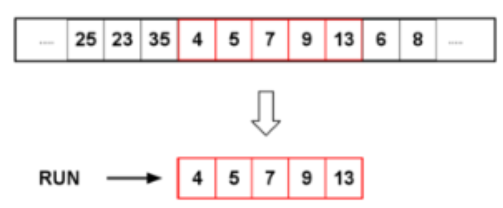

### 목차

- [삽입 정렬, Insertion Sort](#삽입-정렬-Insertion-Sort)
- [버블 정렬, Bubble Sort](#버블-정렬-Bubble-Sort)
- [기수 정렬, Radix Sort](#기수-정렬-Radix-Sort)
- [계수 정렬, Counting Sort](#계수-정렬-Counting-Sort)
- [팀 정렬, Tim Sort](#팀-정렬-Tim-Sort)

 

<a href="https://github.com/jarvis08/Reminders">메인으로</a>

 

**정리 요점**

1. **정렬 방법**
2. **Stable**/**Unstable**
3. **최선**의 경우 시간복잡도
4. **어떤 경우에 최선**의 시간 복잡도를 갖는가
5. **평균**적인 시간 복잡도
6. **최악**의 경우 시간복잡도
7. **어떠한 경우에 최악**의 시간 복잡도를 갖는가

 

<a href="#목차" style="text-align: right;">맨 위로</a>

 

## **삽입 정렬, Insertion Sort**

1. 맨 앞에서 두 번째(index 1) 요소 부터 시작하여, 보다 앞의 요소들과 비교하여 자신의 위치에 삽입
2. Stable
3. 최선 - O(`n`)
4. 이미 정렬되어 있는 경우로, 비교만 하면 된다.
5. 평균 - O(`n^2`)
6. 최악 - O(`n^2`)
7. 역순으로 정렬된 상태일 때

자료가 소량인 경우에 유리하며, 알고리즘이 간단하다는 장점이 있다.

새로운 배열을 생성하는 것이 아니라, 입력되는 배열 내부적으로 작업을 수행하므로 공간 복잡도가 작다.

이미 정렬되어 있는 자료 구조에 새로운 요소를 삽입하거나 기존 요소를 삭제하는 경우 오버헤드가 매우 적다.

 

<a href="#목차" style="text-align: right;">맨 위로</a>

 

## 버블 정렬, Bubble Sort

1. 좌측에서 우측으로 인접한 두 요소를 반복적으로 비교하며 크기가 큰 요소를 계속해서 뒤 인덱스로 옮기며 정렬
2. Stable
3. 최선 - O(`n`)
4. 이미 정렬된 자료
5. 평균 - O(`n^2`)
6. 최악 - O(`n^2`)
7. 모든 요소들을 비교할 때

오름차순으로 정렬하고자 할 경우 한 싸이클 진행 시 가장 큰 값이 맨 뒤에 저장된다. 그리고 싸이클이 진행될 수록 싸이클 당 진행 작업 회수는 하나씩 줄어든다(`전체 배열의 크기` – `현재까지 순환한 바퀴 수`).

시간복잡도는 거의 모든 상황에서 `최악`의 성능을 보여준다.

`공간복잡도`는 단 하나의 배열에서 진행하므로 `O(n)`이다.

 

<a href="#목차" style="text-align: right;">맨 위로</a>

 

## 기수 정렬, Radix Sort

1. 다중키를 사용하며, 자리 수가 같은 요소들 끼리 비교하여 정렬하는 방법
2. Stable
3. 최선/평균/최악 - O(`n`)
4. 다중키를 사용하여 비교적 많은 공간을 사용하며, '자리수'가 존재하는 자료형만 가능(부동소주점 형태는 불가)

- LSD: 가장 작은 자리 수 부터 비교하는 방법
- MSD: 가장 큰 자리 수 부터 비교하는 방법

참고 자료: [위키백과](https://ko.wikipedia.org/wiki/기수_정렬)

다중키를 사용하여 비교적 많은 공간을 사용하지만, 상대적으로 수행 시간이 적게 든다.

비교 연산을 하지 않으며 정렬 속도가 빠르지만 데이터 전체 크기에 기수 테이블의 크기만 한 메모리가 더 필요하다. 자리 수를 비교해서 정렬하는 방식이므로, 자리 수가 없는 것들은 정렬할 수 없다.

(i.g., 부동소수점 형태의 자료형)

 

<a href="#목차" style="text-align: right;">맨 위로</a>

 

## 계수 정렬, Counting Sort

1. 요소 별 개수를 세어 카운팅 배열에, 값에 해당하는 인덱스에 삽입한 후 뒤에서 부터 추출하여 새로운 배열에 삽입
2. Stable
3. 최선/평균/최악 - O(`n`)
4. 0이상 정수로의 표현 가능해야 사용이 가능

카운팅 정렬은 매우 빠른 정렬 속도를 보유하지만, 자료의 숫자 범위가 큰 경우 비 효율적이다. 카운팅 정렬은 인덱스 배열에 인덱스에 해당하는 인풋 자료값의 개수를 카운팅하기 때문이다.

비효율적인 상황의 예로, `[1, 250, 3, 5, 235]` 형태의 배열을 정렬할 때, 카운팅 배열의 크기는 251이 될 것이다.

 

<a href="#목차" style="text-align: right;">맨 위로</a>

 

## 팀 정렬, Tim Sort

1. [합병 정렬](https://www.notion.so/jarvis08/Overall-of-Sorting-Algorithms-f0c43eb0f1134b7eaf9196ebccb6059f#2baf81ef347743adb3f47b41b6b6fbee)과 [삽입 정렬](https://www.notion.so/jarvis08/Overall-of-Sorting-Algorithms-f0c43eb0f1134b7eaf9196ebccb6059f#5ef527abfd804cb68125d3419d62c320)을 혼합한 방법

2. Stable

3. 최선 - O(`n`)

   최상의 경우 [삽입 정렬](https://www.notion.so/jarvis08/Overall-of-Sorting-Algorithms-f0c43eb0f1134b7eaf9196ebccb6059f#5ef527abfd804cb68125d3419d62c320)의 O(n)를 복잡도를 가지고, 최악의 경우 [합병 정렬](https://www.notion.so/jarvis08/Overall-of-Sorting-Algorithms-f0c43eb0f1134b7eaf9196ebccb6059f#2baf81ef347743adb3f47b41b6b6fbee)의 O(n logn)를 가진다.

4. 평균/최악 - O(`n logn`)

2002년에 파이썬으로 최초로 구현됐다.  [합병 정렬](https://www.notion.so/jarvis08/Overall-of-Sorting-Algorithms-f0c43eb0f1134b7eaf9196ebccb6059f#2baf81ef347743adb3f47b41b6b6fbee)은 원소의 개수가 적을 경우 오버헤드가 발생하기 때문에 파티션 크기가 특정 값 이하(보통 16 또는 32)가 되면 [삽입 정렬](https://www.notion.so/jarvis08/Overall-of-Sorting-Algorithms-f0c43eb0f1134b7eaf9196ebccb6059f#5ef527abfd804cb68125d3419d62c320)을 사용한다. [합병 정렬](https://www.notion.so/jarvis08/Overall-of-Sorting-Algorithms-f0c43eb0f1134b7eaf9196ebccb6059f#2baf81ef347743adb3f47b41b6b6fbee)과 비슷한 특징을 가지고, 대부분의 경우 더 빠르며, 가장 많이 사용되는 정렬 중 하나이다.

현실 세계에 있는 데이터가 램덤하게 흩어진 형태 보다는, 대략적으로 **정렬된 상태**로 있다는 것에 기반 하여 디자인된 알고리즘이다.

다음은 [GamZehYaavor](http://blog.naver.com/PostView.nhn?blogId=talag&logNo=221020181491)님의 블로그 내용의 일부를 정리한 내용이다.

n개의 요소로 이루어진 배열을 처음부터 살펴보면서, **non-descending 데이터** 혹은 **strictly descending** 데이터를 찾는다. 정렬된 형태의 짧은 배열을 **run** 이라고 부른다. 즉, 데이터를 처음부터 살펴보면서 이미 정렬되어 있는 데이터를 찾고, 하나의 `run`이라고 분류한다.

이후, 정렬되지 않은 값들(random하게 포진된 값을 가지는 데이터의 시퀀스)은 `minrun`이라 불리는 일정 단위로 데이터를 자른다.

`minrun`의 경우 보통 `32 ~ 64` 정도의 값을 유지하는데, 보통 2의 지수승을 사용한다(나중에 merge할 때 조건을 수월하게 만족하기 위해). 자바에서는 경험상 좋다는 이유로 32값을 유지한다.

그렇게 32개 혹은 64개씩의 정렬이 되어 있지 않은 데이터에 대해 선택 정렬을 사용한다. 정렬된 데이터는 다시 `run`으로 사용된다.

만들어진 run들은 stack에 쌓아두며, 중간 중간에 merge를 합니다.

 

<a href="#목차" style="text-align: right;">맨 위로</a>