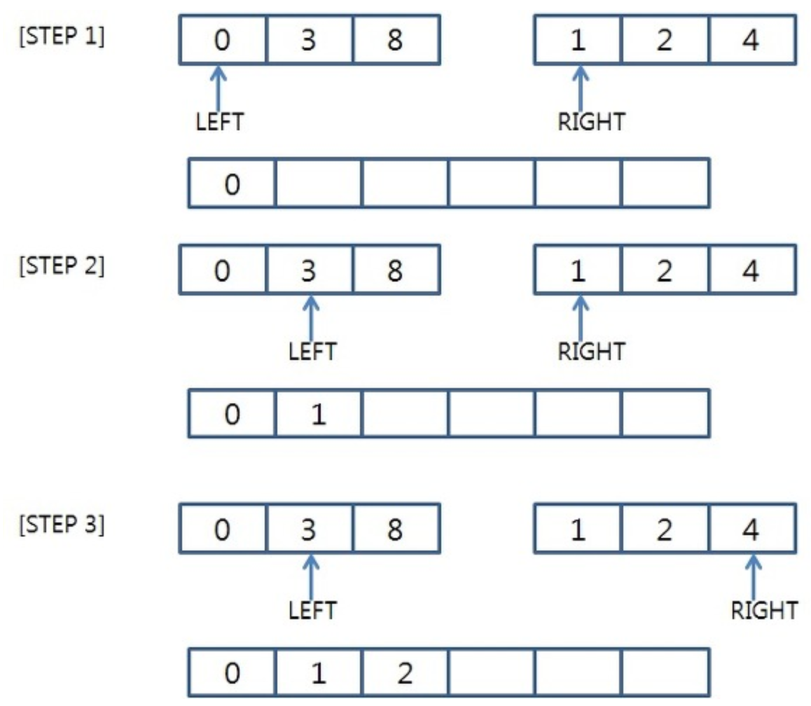

### 목차

- [셸 정렬, Shell Sort](#셸-정렬-Shell-Sort)
- [합병 정렬, Merge Sort](#합병-정렬-Merge-Sort)
- [퀵 정렬, Quick Sort](#퀵-정렬-Quick-Sort)
- [힙 정렬, Heap Sort](#힙-정렬-Heap-Sort)

 

<a href="https://github.com/jarvis08/Reminders">메인으로</a>

 

## **셸 정렬, Shell Sort**

1. 입력 파일을 여러 개의 부분 파일로 세분화 후 부분 파일들을 [삽입 정렬](https://www.notion.so/jarvis08/Overall-of-Sorting-Algorithms-f0c43eb0f1134b7eaf9196ebccb6059f#5ef527abfd804cb68125d3419d62c320)
2. Stable
3. 최선 - O(`n logn`)
4. 평균 - O(`n (logn)^2`)
5. 최악 - O(`n (logn)^2`)
6. [삽입 정렬](https://www.notion.so/jarvis08/Overall-of-Sorting-Algorithms-f0c43eb0f1134b7eaf9196ebccb6059f#5ef527abfd804cb68125d3419d62c320)을 개선한 알고리즘이며, 방법에 따라 순차적으로 정렬하는 과정을 반복한다.

- Gap

  우선적으로 데이터를 띄엄띄엄 정렬시켜 둔다.

  1. gap 만큼 떨어진 데이터들을 부분정렬
  2. gap은 N/2 ~ 1
  3. gap = 1일 경우 데이터 전체를 [삽입 정렬](https://www.notion.so/jarvis08/Overall-of-Sorting-Algorithms-f0c43eb0f1134b7eaf9196ebccb6059f#5ef527abfd804cb68125d3419d62c320)한 것과 같다.

 

<a href="#목차" style="text-align: right;">맨 위로</a>

 

## 합병 정렬, Merge Sort

1. 배열을 쪼갠 후, 쪼개어진 이미 정렬되어 있는 2개의 파일을 하나의 정렬된 파일로 만들며 전체를 정렬
2. Stable
3. 최선/평균/최악 - O(`n logn`)
4. 크기가 1인 배열로 분할하는 과정에 O(`logn`) 소요

분할 과정: 배열을 반으로 쪼개며, 배열의 크기가 0이나 1이 될 때 까지 쪼갠다. 분할 과정을 n번 거쳐야 크기가 1인 배열로 쪼갤 수 있으며, 분할 별로 합병을 진행한다.

평균적인 [퀵 정렬](https://www.notion.so/jarvis08/Overall-of-Sorting-Algorithms-f0c43eb0f1134b7eaf9196ebccb6059f#b092ea76459e4ec1abdbb063a37dc159)보다 느리며, 데이터 크기 만큼의 메모리가 더 필요하므로 **공간복잡가 크다**.

- 합병 과정
  1. 2개의 리스트의 값들을 처음부터 하나씩 비교하여 두 개의 리스트의 값 중에서 더 작은 값을 새로운 리스트(sorted)로 옮긴다.
  2. 둘 중에서 하나가 끝날 때까지 이 과정을 되풀이한다.
  3. 만약 둘 중에서 하나의 리스트가 먼저 끝나게 되면 나머지 리스트의 값들을 전부 새로운 리스트(sorted)로 복사한다.
  4. 새로운 리스트(sorted)를 원래의 리스트(list)로 옮긴다.

다음은 분할 이후, 합병하는 과정을 보여주는 그림이다. 합병해야 하는 두 배열의 원소들을 비교하며, 작은 값부터 새로운 배열에 삽입한다. 한 쪽의 배열의 삽입이 모두 끝나면, 남은 한 쪽의 남은 원소들을 한번에 삽입한다.

참고 자료: [Ju Factory](https://yujuwon.tistory.com/entry/병합정렬Merge-Sort)

 

<a href="#목차" style="text-align: right;">맨 위로</a>

 

## 퀵 정렬, Quick Sort

1. 분할 정복을 응용하지만, [합병 정렬](https://www.notion.so/jarvis08/Overall-of-Sorting-Algorithms-f0c43eb0f1134b7eaf9196ebccb6059f#2baf81ef347743adb3f47b41b6b6fbee)과는 다르게 Pivot을 이용하여 비균등 분할을 하며, 분할과 동시에 정렬을 진행
2. Unstable
3. 최선/평균 - O(`n logn`)
4. 최악 - O(`n^2`)
5. 피벗이 계속해서 최소/최대값으로 지정될 때

평균적으로 가장 좋은 성능을 내며, 스택 구조와 순환적 알고리즘을 사용한다.

- 과정 
  1. 피봇 값 설정
  2. 피봇 보다 작은 값은 피봇 왼쪽에, 큰 값은 피봇 오른쪽으로 이동
  3. 피봇 제외하고 왼쪽리스트, 오른쪽 리스트에 대해 재귀적으로 수행
  4. 부분 리스트를 더이상 분할할 수 없을 때까지 반복

가장 많이 구현되는 정렬 알고리즘 중 하나이며, `C`, `C++`, `PHP`, `Java`등 거의 모든 언어에서 제공하는 정렬 함수에서 퀵 정렬 혹은 퀵 정렬의 변형 알고리즘을 사용한다.

방식은 먼저 적절한 원소 하나를 기준(`피벗 ,pivot`)으로 삼아 그보다 작은것을 앞으로 빼내고 그 뒤에 피벗을 옮겨 피벗보다 작은 것, 큰 것으로 나눈다.

그리고 각각에서 다시 피벗을 잡고 정렬해서 각각의 크기가 0이나 1이 될 때까지 정렬한다.

- 피벗 잡는 방법.
  1. 난수(Random Quick Sort), 중위법 
     - 가장 쉽고 비효율적인 방법.
  2. 배열 중 3~9개의 원소를 골라서 이들의 중앙값을 피벗으로 고르는 것
     - Visual c++과 gcc에서 구현하고 있는 방법
     - 최악의 경우가 나올 수 있지만, 그 경우가 극히 드물게 된다.
  3. 인트로 정렬 
     - 재귀 깊이가 어느 제한 이상으로 깊어질 경우 [힙 정렬](https://www.notion.so/jarvis08/Overall-of-Sorting-Algorithms-f0c43eb0f1134b7eaf9196ebccb6059f#90ad70185a554e6c94bb67782286aad2) 알고리즘을 사용하여 항상 O(n log n)을 보장해주는 방법

 

<a href="#목차" style="text-align: right;">맨 위로</a>

 

## 힙 정렬, Heap Sort

1. 모든 원소를 힙(완전 이진 트리 구조)에 삽입한 후 root부터 삭제하며 새로운 배열에 저장
2. Unstable
3. 최선/평균/최악 - O(`n logn`)
4. 노드 하나를 삽입/삭제할 때 O(`logn`)을 소요

완전 이진 트리를 이용하고, 일정한 기억장소만을 필요로 한다.

- 최소힙/최대힙 트리를 구성하여 정렬하는 방법. 
  1. build heap
  2. root부터 원소 삭제하며 새로운 배열에 저장
- 오름차순 정렬의 자세한 과정 
  1. 자료를 최소힙 형태로 구현
  2. root 요소(가장 작은 값)를 POP 및 정렬한 형태로 나타내고자 하는 배열에 PUSH
  3. 힙의 가장 마지막 노드를 root에 삽입
  4. root에 삽입된 마지막 요소를 크기 비교를 통해 제 위치로 옮김(노드들을 교환하며)
  5. 다시 최소값이 root에 위치해 있으므로, 3~4를 반복하여 힙의 모든 값을 POP하게 되면 정렬 완료
- **자료 전체보다는 최대/최소값 부터 몇 개의 요소를 구할 때 유용하다.**

기본적인 알고리즘은 `[선택 정렬]()`과 동일하다. 하지만 `힙 정렬`의 경우 최소값, 최대값을 찾을 때 배열을 순회하는 것이 아니라, 이미 만들어져 있는 힙을 사용한다. 따라서 요소를 조회하는 것에 `O(log n)`이 소요되며, 정렬하는 것에는 `O(n logn)`이 소요된다.

힙 정렬은 추가적인 메모리를 전혀 필요로 하지 않는다. 또한 최악의 경우 `O(N^2)`의 성능을 내는 퀵 정렬과는 다르게 `항상 일정한 성능`을 발휘하므로, 힙 정렬이 보다 안정적인 성능을 갖는다.

`[퀵 정렬]()`은 배열을 사용하므로, 대개 원소들 끼리 근접한 메모리 영역을 사용한다. 하지만 `힙 정렬`의 경우 원소들이 보다 흩어져 있는 경우가 많아 `캐시 친화도`가 떨어진다.

또한 `힙정렬`은 일반적으로 `포인터 연산`을 많이 하기 때문에 `오버헤드가 크다`.

 

<a href="#목차" style="text-align: right;">맨 위로</a>