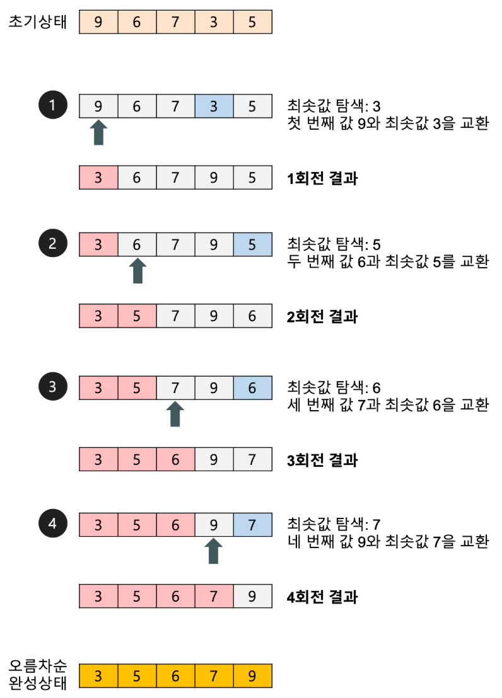

### 목차

- [선택 정렬, Selection Sort](#선택-정렬-Selection-Sort)

 

<a href="https://github.com/jarvis08/Reminders">메인으로</a>

 

## 선택 정렬, Selection Sort

1. 오름차순 정렬의 경우, 가장 작은 값은 값을 찾아서 index 0에, 다음으로 작은 값은 index 1에, 차례대로 최소값을 찾아 삽입하는 과정을 반복
2. Unstable
3. 최선/평균/최악 - O(`n^2`)
4. 최악/최상 어떤 경우이든 요소 전부를 비교

이미지 출처: [Heee's Development Blog](https://gmlwjd9405.github.io/2018/05/06/algorithm-selection-sort.html)

선택되지 않았던 모든 요소들을 훑고, 그 중에서 가장 작은 요소를 골라내어 미리 정해둔 인덱스에 삽입하는 과정을 n번 반복한다.

배열의 상태와 무관하게 `n(n-1)/2` 에 비례하는 시간이 소요되며, **일반적으로 [버블 정렬](https://www.notion.so/jarvis08/Overall-of-Sorting-Algorithms-f0c43eb0f1134b7eaf9196ebccb6059f#9cf095d21b6945c2886dadfd4d212eab)보다 약 두 배 빠르다**. 단 하나의 배열에서만 진행하므로 공간복잡도는 O(n)이다.

<a href="#목차" style="text-align: right;">맨 위로</a>