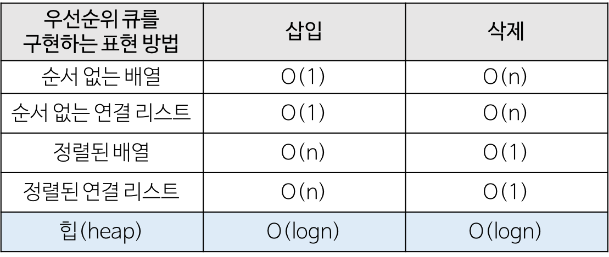

### 목차

1. [트리 개요](#1-트리-개요)
   1. 트리의 표현
   2. 트리의 종류
   3. 트리의 용어
   4. 균형 트리의 종류
2. [이진 트리, Binary Tree](#2-이진-트리-Binary-Tree)
   1. 이진 트리의 형태
   2. 이진 트리의 표상
   3. 이진 트리의 순회
   4. 힙
3. [이진 탐색 트리, Binary Search Tree](#3-이진-탐색-트리-Binary-Search-Tree)
   1. 이진 탐색 트리의 정의
   2. 이진 탐색 트리의 순회
   3. (균형) Red-Black Tree
   4. (균형) AVL Tree
4. [트리 심화](#4-트리-심화)

<br>

<a href="https://github.com/jarvis08/Reminders">메인으로</a>

<br>

# 1. 트리 개요

> 원소 간의 관계가 1:N

> 비선형 구조

> 원소들 간에 계층 관계를 가지는 계층형 자료 구조

> 상위 원소에서 하위 원소로 내려가면서 확장되는 트리(나무) 모양의 구조

트리는 한 개 이상의 노드로 이루어진 유한 집합이며, 다음 조건을 만족한다.

1. 노드 중 최상위 노드를 루트(root)라고 한다.
2. 나머지 노드들은 n(>=0) 개의 분리 집합 T1, T2, ... , TN으로 분리될 수 있다.

이들 T1, T2, ... , TN은 각각 하나의 트리가 되며(재귀적 정의), 루트의 부 트리(subtree)라고 한다.

<br>

### 1-1. 트리의 표현

- 1차 배열
- 리스트
- 스태틱 링크드 리스트

<br>

### 1-2. 트리의 종류

- 이진 트리, Binary Tree
- 이진 탐색 트리, Binary Search Tree
- 힙, Heap
- 트라이, Trie
- 허프만 트리
- 아호코라식 트리, Aho-Corasick Tree
- 세그먼트 트리, Segmant Tree

<br>

### 1-3. 트리의 용어

- `간선(edge)`: 노드를 연결하는 선이며, 부모 노드와 자식 노드를 연결

- ```
  노드(node)
  ```

  : 트리의 원소 

  - `루트 노드(root node)`: 트리의 시작 노드
  - `형제 노드(sibling node)`: 같은 부모를 가진 자식 노드들
  - `조상 노드`: 간선을 따라 루트 노드까지 이르는 경로에 있는 모든 노드들
  - `자손 노드`: 서브 트리에 있는 하위 레벨의 노드들

- ```
  서브 트리(subtree)
  ```

  : 부모 노드와 연결된 간선을 끊었을 때 생성되는 트리 

  - `숲(forest)`: 서브 트리들

- ```
  차수(degree)
  ```

  : 어떤 노드에 연결되어 있는 간선의 수 

  - `진출 차수`: 방향성이 있는 간선으로 트리가 구성될 때, 해당 노드로 진입되는 간선의 수
  - `진입 차수`: 방향성이 있는 간선으로 트리가 구성될 때, 해당 노드에서 진출하는 간선의 수

- `높이`: 루트 노드로 갈 때, 통과해야 하는 간선의 수이며, 노드의 `레벨(level)``

- `이진 트리`: 모든 노드들이 최대 2 개의 서브 트리를 갖을 수 있는 특별한 형태의 트리이며, 자식 노드는 왼쪽 자식 노드(left child node)와 오른쪽 자식 노드(right child node)로 구성된다.

<br>

### 1-4. 균형 트리의 종류

- 다진 트리 

  - 2-3-4 Tree

  - B Tree

    2-3-4 Tree가 1024 bit까지 계산되는 큰 규모의 트리

  - B+ Tree

  - B* Tree

- 자가 균형 트리(이진 탐색 트리를 응용) 

  - AVL

    노드 별 balance factor를 사용

    `balance factor = Lh - Rh` 왼쪽 서브트리의 높이와 오른쪽 서브트리의 높이의 차를 -1~1을 유지하도록 트리를 구성

    - 네가지 패턴 
      - LL
      - LR
      - RR
      - RL

  - Red-Black

<br>

<a href="#목차" style="text-align: right;">맨 위로</a>

<br>

# 2. 이진 트리, Binary Tree

노드들이 최대 2개의 자식을 갖을 수 있는  트리이다.

- 이진 트리의 특성
  - 레벨 i의 최대 노드 개수는 2^i 개
  - 높이가 `h`인 이진 트리의 최소 노드 개수는 `h+1` 개 이며, 최대 노드 개수는 `2^(h+1) - 1` 개
- 트리의 표현 - 배열
  - 왼쪽 자식의 인덱스는 언제나 `(자신 인덱스) x 2`
  - 부모의 인덱스는 언제나 `floor((자신 인덱스) / 2)`
- 배열 이용의 단점 
  - 편향 이진 트리의 경우 사용하지 않는 배열의 원소가 많아 메모리 공간 발생
  - 트리 중간에 노드를 삽입하거나, 기존 노드를 삭제 할 때 오버헤드가 크게 발생

<br>

<br>

## 2-1. 이진 트리의 형태


- 전 이진 트리, Full Binary Tree
- 완전 이진 트리, Complete Binary Tree
- 포화 이진 트리, Perfect Binary Tree

<br>

### 전(정) 이진 트리, Full Binary Tree

**Strictly Binary Tree**라고도 불리며, 모든 노드가 0개 혹은 2개의 자식 노드를 가지는 트리이다.


- 모든 leaf가 같은 depth를 가진다.
- leaf가 아닌 모든 노드들은 2개의 자식 노드를 가진다.

<br>

### 완전 이진 트리, Complete Binary Tree

마지막 레벨은 꽉 차지 않았지만, 잎(Leaf)들을 제외한 나머지 노드들은 모두 2개의 자식 노드를 가진다.


- 가장 깊은 depth를 제외한 depth의 노드들은 모두 존재해야 한다.
- 가장 깊은 depth의 노드들은 왼쪽부터 채워진다.
- 마지막 레벨 h(root 제외)에서 (1 ~ 2h-1)개의 노드를 가질 수 있다.

<br>

### 포화 이진 트리, Perfect Binary Tree

Leaf의 레벨까지 모두 꽉 차있는 이진 트리이며, 정 이진트리와 완전 이진트리를 모두 만족하는 트리 구조

- 트리의 높이가 `k`(root 포함)일 때, `전체 노드의 개수 = 2^k - 1`

<br>

<br>

## 2-2. 이진 트리의 표상

### with Array

인덱스 규칙에 따라 부모 노드와 자식 노드를 찾기가 쉽다. 그러나 일차원 배열이기 때문에 메모리 공간의 사용에 있어서 완전 이진 트리의 경우에는 최적으로 공간을 사용할 수 있지만, 편향 이진트리의 경우에는 많은 공간이 낭비된다. 그렇기 때문에 메모리 낭비 문제와 삽입, 삭제 연산이 비효율적이기 때문에 연결 자료구조 방식을 많이 사용한다.

- Root는 [0]
- Left는 [2i + 1]
- Right는 [2i + 2]

<br>

### with Node

- data_field : 데이터 저장
- left_field : Left를 가리키는 포인터 저장
- Right_field : Right를 가리키는 포인터 저장

- 이진트리의 구현 방식

  1. 순차 자료구조 방식

     인덱스 1번부터 시작하여 i번째 인덱스를 지정해 일차원 배열에 저장한다. 그렇게 되면 부모의 노드는 i/2가 되고, 왼쪽 자식의 노드는 2*i 오른쪽 자식의 노드는 2*i+1가 된다.

  2. 연결 자료구조 방식

     노드는 데이터를 저장하는 데이터필드와 왼쪽 자식노드를 연결하는 왼쪽 링크 필드, 오른쪽 자식노드를 연결하는 오른쪽 링크 필드로 구성한다. 자식노드가 없는 경우에는 링크필드에 null을 저장한다.

<br>

<br>

## 2-3. 이진 트리의 순회


순회에는 세 가지 기본적인 순회 방법이 있다. 재귀적인 방법을 사용하는데, 방문 순위에 따라 전위/후위/후위 순회로 나뉜다.

<br>

### 전위 순회, Pre-order Traversal

1. 부모 노드
2. 자식(좌) 노드
3. 자식(우) 노드

<br>

### 중위 순회, In-order Traversal

1. 자식(좌) 노드
2. 부모 노드
3. 자식(우) 노드

<br>

### 후위 순회, Post-order Traversal

1. 자식(좌) 노드
2. 자식(우) 노드
3. 부모 노드

<br>

<br>

## 2-4. 힙, Heap

이진 트리에 있는 노드 중에서 키 값이 가장 큰 노드 또는 키 값이 가장 작은 노드를 찾기 위해 만든 자료구조이다.

Heap은 특정 노드 N의 값이 항상 자식들보다 큰 Complete Binary Tree이다.

- 특징

  - 무조건 앞에서 부터 채운다(왼쪽 노드)

  - 루트 삭제(최대|최소) 시, 가장 마지막 노드의 값을 루트로 올린 후, 자기 자신의 위치를 찾아간다. 

    - 최대 힙일 경우, 삭제 시 가장 마지막 요소가 루트로 추가되며,

      계속해서 자식 노드 중 큰 값과 교체한다.

- 우선순위 큐(Priority Queue)를 힙으로 구현하기

  

  - Adding New Entry 

    1. Complete Binary Tree에 맞게 마지막 노드에 새 값을 넣는다.
    2. 위쪽 방향으로 Parent와 비교하여 새 값이 크면 Swap한다.

  - Removing an Entry 

    1. 마지막 노드의 값을 삭제하고자 하는 노드에 삽입

       ([힙 정렬](https://www.notion.so/jarvis08/Overall-of-Sorting-Algorithms-f0c43eb0f1134b7eaf9196ebccb6059f#90ad70185a554e6c94bb67782286aad2)의 경우 삭제하는 노드가 항상 root)

    2. 교체한 값을 아래쪽 방향으로 Child와 비교하여 작으면 Swap한다.

- 힙의 종류

  - 최대힙

    직계 조상이 큰 수

  - 최소힙

    직계조상이 작은 수

- 힙의 삽입

  배열의 가장 마지막 부분에 위치(트리의 끝부분)시킨 후, 직계 조상과 비교하여 알맞은 위치로 찾아감

  최대힙은 직계조상과 비교하여 클수록 위로 올라감

- 힙의 삭제

  루트를 제거한 후, 배열의 가장 마지막 부분에 위치(트리의 끝부분)한 노드를 루트로 올리고, 직계 자손과 비교하여 알맞은 위치로 찾아감

  최대히프는 직계자손과 비교하여 작을수록 아래로 내려감

<br>

<a href="#목차" style="text-align: right;">맨 위로</a>

<br>

# 3. 이진 탐색 트리, Binary Search Tree

## 3-1. 이진 탐색 트리의 정의

이진트리는 효율적으로 사용하기 위해서 일정한 형태로 정의한것이다. 탐색을 위한 자료구조로 이진 트리를 사용하기 위해서 저장할 데이터의 크기에 따라 노드의 위치를 정의 한 것이 이진 탐색 트리이다.

모든 노드 n에 대해서 다음 조건을 반드시 만족한다.

```
모든 왼쪽 자식들 <= n < 모든 오른쪽 자식들
```

- 어떤 노드의 Left Subtree의 값은 항상 해당 노드의 값보다 작거나 같다.
- 어떤 노드의 Right Subtree의 값은 항상 해당 노드의 값보다 크다.
- 공백이 가능한 이진 트리
- 이진 트리와의 차이 
  1. 모든 원소는 서로 다른 유일한 키를 가지고 있다.
  2. 왼쪽 서브 트리에 있는 원소의 키들은 그 루트의 키보다 작다.
  3. 오른쪽 서브트리에 있는 원소의 키들은 그 루트의 키보다 크다.
  4. 왼쪽 서브트리와 오른쪽 서브 트리도 이진 탐색 트리이다.

배열에 이진 탐색 트리의 노드들이 담겨있을 경우, 루트 노드를 선정(`ceil(N+1//2)`)한 후에 규칙에 따라 노드를 제 위치에 삽입한다.

<br>

<br>

## 3-2. 이진 탐색 트리의 특징

### 순회

root와 비교하여 크면 오른쪽, 작으면 왼쪽과 비교

- 잎(leaf)이 나올 때까지 비교하고 삽입
- 트리의 높이가 h라면 삽입에 필요한 시간은 O(`h`)

<br>

### 이진 탐색 트리의 문제점

만약 데이터셋의 값들 중 매우 큰 편에 속하는 값이 루트 노드에 위치할 경우, 매우 편향된 형태의 트리 구조를 갖게 된다. 그럴 경우 트리의 높이 `h`가 매우 커지면서 이진 탐색 트리의 장점을 잃게 된다.

이러한 균형에 대한 문제를 해결하기 위해 고안된 것이 균형 트리인 **Red-Black Tree**와 **AVL Tree**이다.

<br>

<br>

## 3-3. (균형) Red-Black Tree

자료 출처: [JaeYeopHan's Github](https://github.com/JaeYeopHan/Interview_Question_for_Beginner/tree/master/DataStructure)

**Balanced Binary Search Tree**이다.

RBT(Red-Black Tree)는 BST 를 기반으로하는 트리 형식의 자료구조이다. 결론부터 말하자면 Red-Black Tree 에 데이터를 저장하게되면 Search, Insert, Delete 에 O(log n)의 시간 복잡도가 소요된다. 동일한 노드의 개수일 때, depth 를 최소화하여 시간 복잡도를 줄이는 것이 핵심 아이디어이다. 동일한 노드의 개수일 때, depth 가 최소가 되는 경우는 tree 가 complete binary tree 인 경우이다.

<br>

### Red-Black Tree 의 정의

Red-Black Tree 는 다음의 성질들을 만족하는 BST 이다.

1. 각 노드는 `Red` or `Black`이라는 색깔을 갖는다.
2. Root node 의 색깔은 `Black`이다.
3. 각 leaf node 는 `black`이다.
4. 어떤 노드의 색깔이 `red`라면 두 개의 children 의 색깔은 모두 black 이다.
5. 각 노드에 대해서 노드로부터 descendant leaves 까지의 단순 경로는 모두 같은 수의 black nodes 들을 포함하고 있다. 이를 해당 노드의 `Black-Height`라고 한다.*cf) Black-Height: 노드 x 로부터 노드 x 를 포함하지 않은 leaf node 까지의 simple path 상에 있는 black nodes 들의 개수*

<br>

### Red-Black Tree 의 특징

1. Binary Search Tree 이므로 BST 의 특징을 모두 갖는다.
2. Root node 부터 leaf node 까지의 모든 경로 중 최소 경로와 최대 경로의 크기 비율은 2 보다 크지 않다. 이러한 상태를 `balanced` 상태라고 한다.
3. 노드의 child 가 없을 경우 child 를 가리키는 포인터는 NIL 값을 저장한다. 이러한 NIL 들을 leaf node 로 간주한다.

*RBT 는 BST 의 삽입, 삭제 연산 과정에서 발생할 수 있는 문제점을 해결하기 위해 만들어진 자료구조이다. 이를 어떻게 해결한 것인가?*

<br>

### 삽입

우선 BST 의 특성을 유지하면서 노드를 삽입을 한다. 그리고 삽입된 노드의 색깔을 **RED 로** 지정한다. Red 로 지정하는 이유는 Black-Height 변경을 최소화하기 위함이다. 삽입 결과 RBT 의 특성 위배(violation)시 노드의 색깔을 조정하고, Black-Height 가 위배되었다면 rotation 을 통해 height 를 조정한다. 이러한 과정을 통해 RBT 의 동일한 height 에 존재하는 internal node 들의 Black-height 가 같아지게 되고 최소 경로와 최대 경로의 크기 비율이 2 미만으로 유지된다.

<br>

### 삭제

삭제도 삽입과 마찬가지로 BST 의 특성을 유지하면서 해당 노드를 삭제한다. 삭제될 노드의 child 의 개수에 따라 rotation 방법이 달라지게 된다. 그리고 만약 지워진 노드의 색깔이 Black 이라면 Black-Height 가 1 감소한 경로에 black node 가 1 개 추가되도록 rotation 하고 노드의 색깔을 조정한다. 지워진 노드의 색깔이 red 라면 Violation 이 발생하지 않으므로 RBT 가 그대로 유지된다.

Java Collection 에서 ArrayList 도 내부적으로 RBT 로 이루어져 있고, HashMap 에서의 `Separate Chaining`에서도 사용된다. 그만큼 효율이 좋고 중요한 자료구조이다.

<br>

<br>

## 3-4. (균형) AVL Tree

자료 출처: [ratsgo's blog](https://ratsgo.github.io/data structure&algorithm/2017/10/27/avltree/)

**Balanced Binary Search Tree**이다.

AVL 트리란 서브 트리의 높이를 적절하게 제어해 전체 트리가 어느 한쪽으로 늘어지지 않는 balanced 이진 탐색 트리의 일종이다. 이진 탐색 트리의 시간 복잡도는 O(h)이며, 균형이 잡히도록 트리를 구성할 경우 h를 줄일 수 있기 때문에 연구하게 됐다.

AVL 트리의 핵심 개념들 중 하나는 **Balance Factor(BF)**이다. `BF = 왼쪽 서브 트리의 높이 - 오른쪽 서브 트리의 높이`. 두 서브 트리의 높이가 같거나 잎이라면 BF는 0이다(empty tree의 BF는 -1로 정의).


BF가 클 수록 불균형 트리라고 할 수 있다. AVL 트리는 요소를 삽입(insert)하거나 삭제(delete)하는 과정에서 서브 트리를 재구성해 트리 전체의 균형을 맞춘다. 삽입/삭제 연산 시 BF가 일정 값 이상(보통 2) 혹은 이하(-2)로 바뀐 노드를 기준으로 그 서브 트리들의 위치를 *rotation*하는 방식을 취한다. *rotation*에는 두 가지 방식이 있다.

<br>

<a href="#목차" style="text-align: right;">맨 위로</a>

<br>

# 4. 트리 심화

### 트라이, Trie

i.g., 검색 엔진에 b만 써 놓으면, boy book 등의 추천 단어가 아래에 뜬다.

Retrieval의 trie에서 따온 용어이다. 노드 하나 당 문자 하나를 보유하며, 노드를 끝까지 따라가면 단어가 하나 생성된다.

n-차 트리(n-ary Tree)의 변종이며, 접두사를 빠르게 찾아보기 위한 방식이다. **각 노드에 문자를 저장**하는 자료 구조이며, **트리를 아래쪽으로 순회하면 단어 하나가 생성**된다. 유효한 단어 집합을 이용 하는 많은 문제들은 트라이를 통해 최적화할 수 있다.

- 키 탐색을 위해 키의 값을 직접 표현하지 않고 키를 구성하는 문자나 숫자의 순서로 키의 값을 표현한 자료 구조이다.
- 트라이의 차수는 키의 값을 표현하기 위해 사용하는 문자의 수에 의해 결정된다.
- 트라이의 크기는 나타내려고 하는 키 값의 기수와 키 필드 길이에 의해 결정된다.
- 노드의 삽입 및 삭제할 때, 노드의 분열과 병합이 없다.

<br>

### B-Tree

- Rules of B-Tree 
  - 단일 노드에 저장될 수 있는 최소 개수를 의미하는 양의 정수 *Minimum*이 있다.
  - Rules 
    1. 노드의 데이터 수가 N개이면 자식의 수는 항상 N+1개여야 한다. 즉, 노드 2개의 데이터를 가진다면 그 노드의 자식은 반드시 3개여야 한다.
    2. 노드 내의 데이터는 반드시 정렬된 상태여야 한다.
    3. 노드의 데이터 D1의 왼쪽 서브 트리는 D1보다 작은 값들로 이루어져 있어야 하고, D1의 오른쪽 서브 트리는 D1보다 큰 값들로 이루어져 있어야 한다.
    4. Root 노드가 자식이 있다면 적어도 2개 이상의 자식을 가져야 한다.
    5. Root 노드를 제외한 모든 노드는 적어도 *Minimum/2*개의 데이터를 가지고 있어야 한다. ex) 5차 B트리라면 각 노드는 적어도 2개의 데이터를 가지고 있어야 한다.
    6. Leaf 노드로 가는 경로의 길이가 모두 같다. 즉, Leaf 노드는 모두 같은 레벨에 존재한다.
    7. 입력 자료는 중복될 수 없다.

<br>

### 허프만 트리

0: 왼쪽, 1: 오른쪽

0, 10, 110, 등의 코드를 부여하여 인코딩

빈도수가 높은 노드에 짧은 숫자를 부여

인코딩 된 숫자를 참조하여 디코딩하여 값을 찾아냄

<br>

### Compressed Tries

르트를 제외한 내부 노드들은 최소 2개의 자식

각 간선은 문자열 S의 부분 문자열 라벨(label)이 부여됨

<br>

### Suffix(접미어) Trie

abc가 있을 때,

- c
- bc
- abc

문자열 길이 만큼 노드가 생성된다.

주어진 문장(문단) 전체를 후킹하여 자료 구조로 만든 후(전처리), 탐색 시 빠르게 탐색한다.

*가장 공통적으로 사용하는 접미어 중, 가장 길이가 긴 것은 무엇인가?*

<br>

### Suffix Array

단어 수가 너무 많아지면 Suffix Trie는 약 20배 이상 무겁다. 따라서 배열로 구현한다.

써픽스의 시작 인덱스 만을 가진 Suffix Array를 제작

<br>

### Suffix Array, LCP(Longest Common Prefix)

*mississippi의 모든 부분 문자열을 정렬 했을 때 "ppi"는 몇 번째 단어인가?*

<br>

### 아호코라식 알고리즘, Aho-Corasick Algorithm

KMP 알고리즘은 찾고자 하는 패턴이 하나일 때 사용하며,

Aho-Corasick 알고리즘은 여러 개의 패턴을 한 번에 찾을 때 사용한다.

KMP 알고리즘을 Tree로 만든 것과 같다.

Success Link와 Failure Link가 존재한다.

<br>

### 세그먼트 트리, Segmant Tree

실제 데이터는 단말 노드(잎)이며, 상위 레벨의 노드들은 데이터에 대한 목적하는 메타 데이터를 갖고 있다.

- 예시 
  - 실제 데이터: [2,3,4,5,6]
  - 2, 3, 4 구간의 메타 데이터 = 최대값인 4
  - 5, 6 구간의 메타 데이터 = 최대값인 6
  - 메타 데이터들의 메타 데이터 = 6

<br>

### Index Tree

- DP를 이진 트리화 한 것과 같은 개념

- 세그먼트 트리를 응용한 방법으로 구현한다.

- 자기 구간의 합을 메타 데이터로 사용한다.

- 값 업데이트 시, 조상 메타 데이터들만 변경해 주면 된다.

- **사용 이유 및 기본 개념**

  [9, 8, 1, 7, 2, 4] 배열이 있을 때, 임의의 인덱스로 그 구간의 합을 구하라는 문제가 있다. 그런데 그 문제가 아주 많을 때, 중복되는 계산이 많아진다.

  따라서 값들을 누적한 배열을 따로 만든 후, 특정 구간의 총합을 구하라는 요구가 나왔을 때, `맨 끝 인덱스의 누적값 - 맨 앞 인덱스 이전 값의 누적값` 을 빼준다.

- 예시

  - 누적배열: [9, 17, 18, 25, 27]
  - 문제: 2~4 구간 합 구하기
  - 정답: 27 - 17 = 10

<br>

<a href="#목차" style="text-align: right;">맨 위로</a>