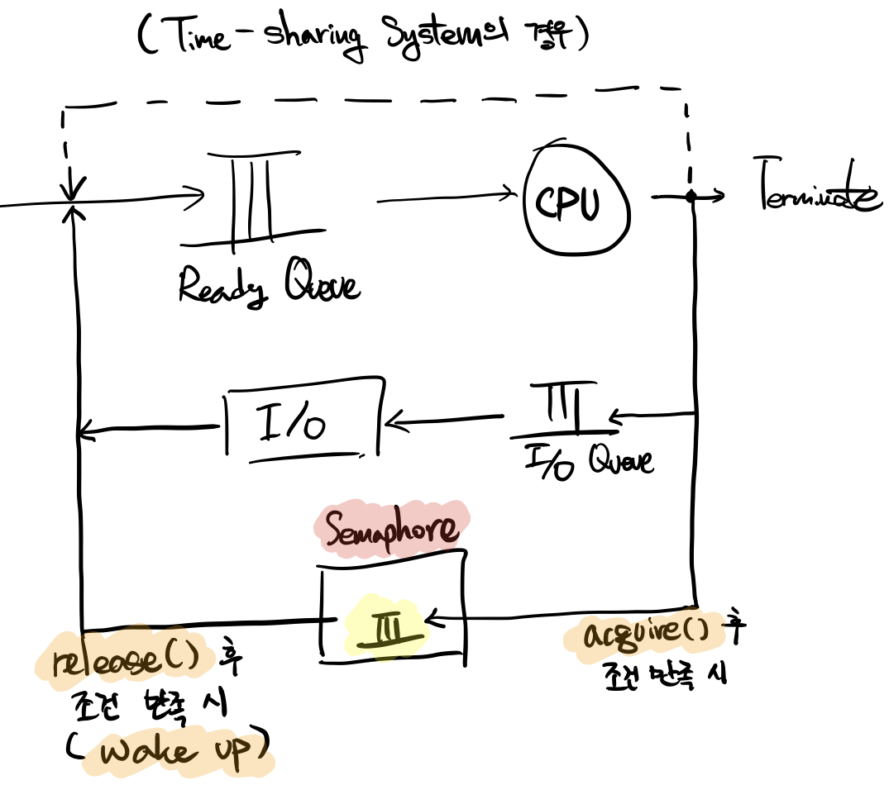

# 1. 프로세스, Process

Process(= Task, Job)는 현재 실행되고 있는 프로그램(Program in execution)을 말하며, 다음의 정보들을 가진다

- `Code`(`Text`), `Data`, `Stack`

- `PC`, Program Counter

  실행하는 프로세스의 주소 정보

- `SP`, Stack Point

- `Register`

- etc

<br>

### 프로세스의 상태, Process State

- `new`

  Memory에 올라온 직후의 상태

- `ready`

  초기화 완료 및 실행 가능한 상태

- `running`

  CPU가 실제로 실행하고 있는 상태

- `waiting`

  CPU 사용이 현재 불필요하거나, 미뤄진 상태

- `terminated`

<br>

<br>

## 1-1. 프로세스 제어 블록, Process Control Block(PCB)

Task Control Block(TCB)라고도 불리며, 프로세스에 대한 모든 정보를 보유한다. 보유하는 정보의 내용은 다음과 같다.

- `Process state`

  - running, ready, waiting, etc

- 주소 정보, Program Counter(`PC`)

  다시 `running` 상태로 돌아왔을 때 작업을 재개하려면 PC, register 등의 정보가 필요하다.

- `registers`

- `MMU` info

  - `base`
  - `limit`

- `CPU time`, CPU 사용 시간

- `Process ID`

- `List of open files`

  사용 중인 파일 목록

- etc

<br>

<br>

## 1-2. 프로세스의 생성과 종료

프로세스는 프로세스에 의해 생성됩니다. 프로세스의 종류로는 부모 프로세스(**`Parent Process`**)와 자식 프로세스(**`Child Process`**)가 있으며, 같은 부모를 둔 자식 프로세스들은 서로 **`Sibling Process`**입니다.

<br>

### Process Tree

운영체제가 Booting을 완료한 후, `init`이라는 프로세스를 자동으로 생성합니다. 이후, `init` 프로세스는 사용자의 명령에 따라 다른 프로세스들을 생성하게 되며, 프로세스 트리(**Process Tree**)를 형성합니다.

<br>

### Process Identifier (PID)

전형적으로 정수이며, 생성되는 순서대로 프로세스에 고유한 ID인 `PID`를 부여합니다.

`PPID`(Parent Process Identifier)는 부모의 PID를 의미합니다.

<br>

### 프로세스를 생성하고 종료하기

- `fork()`: 새로운 프로세스를 생성
- `exec()`: 생성한 프로세스를 메모리에 로드하여 적재
- `exit()`: 프로세스를 종료

프로세스 종료 시, 해당 프로세스가 보유했던 모든 자원(메모리, 파일, 입출력 장치)을 운영 체제에게 반환합니다.

<br>

<br>

## 1-3. 프로세스 대기열(Queue)

### Main Memory Queue

- **`Job Queue`**

  **메모리 사용의 대기열**이다.

- **`Job Scheduler`**

  대기열의 프로그램들 중 **어떤 프로그램을 메모리에 적재할 지 결정하는 프로그램**이다.

  - Job Scheduling은 빈번하게 일어나지 않기 때문에 **`Long-term Scheduler`**라고도 부른다.

    i.g., 메모리 제한 용량이 가득차면, Job Scheduler가 할 일이 없다.

<br>

### I/O-bound Process & CPU-bound Process

Job Scheduler는 Job Queue에서 다음 작업을 선택할 때, 다음에 설명할 **I/O-bound Process**와 **CPU-bound Process**를 적절히 배분하여  선택해야 한다.

- **`I/O-bound Process`**

  작업해야 하는 내용이 주로 I/O를 사용하는 프로세스이며, 아래의 예시가 있다.

  - Word Processor
  - 타자 연습 프로그램

- **`CPU-bound Process`**

  CPU(계산) 사용이 많은 프로세스이며, 기상청의 일기 예측 프로그램과 같은 프로그램이 그 예이다.

<br>

### CPU Queue

- **`Ready Queue`**

  **CPU 사용의 대기열**이다.

- **`CPU Scheduler`**

  CPU 대기열 중 어떤 작업을 `running` 상태로 전환할 지 선택하는 프로그램이다.

  - `running`과 `waiting`을 빠르게 결정하여 작업을 진행하기 때문에 **`Short-term Scheduler`**라고도 부른다.

    우리는 이 작업이 빠르게 일어나기 때문에 프로그램들이 동시에 실행되고 있다고 느낄 수 있다.

<br>

### Device Queue

- **`Device Queue`**

  I/O 장치와 Disk의 대기열이며, Device Scheduler가 관리한다.

<br>

<br>

## 1-4. 스와핑, Swapping

### Swapping

__대화형 시스템(Interactive System)__은 대부분 **Time-Sharing System**이다. Time-Sharing System의 예시로는 Windows와 Linux가 있다. Time-Sharing System은 **사용자 별로 시간을 분배하여 CPU를 할당**한다.

운영체제는 **`PCB`를 계속해서 확인**하며, 만약 한 사용자가 자리를 작업을 멈추었을 경우, 장기간 동안 작업을 하지 않은 프로세스 및 사용자의 작업 내용을 **Hard Disk**로 **`Swap Out`**한다. 그리고 다시 작업을 시작한 경우 메모리로 **`Swap In`**하며, 여기서의 Hard Disk는 **`Swap Device`**의 역할을 한다. Hard Disk의 물리적 공간은 File System으로 사용되는 공간과 Swap Device로 사용되는 **`Backing Store`**로 나뉜다.

**`Medium-term Scheduler`**는 어떤 작업을 **`Swapping`**(Swap In/Out)할 지 결정한다.

<br>

### Context Switching

`Process-1`에서 `Process-2`로, `Process-2`에서 `Process-3`로 이동하는 등의 전환을 **`Context Switching`**이라고 한다.

- **`Scheduler`**

  현재 프로세스에서 어떤 프로세스로 Context Switching할 것인지 결정한다.

- **`Dispatcher`**

  1. `Process-1`의 현재 정보를 `OS 메모리` 내부의 `PCB-1`에 저장
  2. 전환하려는 프로세스인 `Process-2`의 `PCB-2`를 복원하여 다음 데이터 값들을 변경
     - `PC`(Program Counter)
     - `SP`(Stack Point)
     - `Register`
     - `MMU`(Base, Limit)

- **Context Switching Overhead**

  프로세스간 전환하는 과정에서 발생하는 오버헤드를 말한다.

  오버헤드를 감소시키기 위해서는 C와 같은 High Level Language보다는 Assembly Language를 사용해야 한다.

<br>

<br>

<br>

# 2. CPU 스케쥴링

- 스케쥴링의 대분류 두 가지

  - **`Preemptive`**

    **우선순위**에 따라 CPU 할당을 결정 및 변경

  - **`Non-Preemptive`**

    이미 CPU가 어떤 프로세스를 작업하고 있다면, 해당 **프로세스가 종료되어야만 다음 프로세스를 작업** 가능

<br>

<br>

## 2-1. CPU Scheduling Criteria

- **`이용률, Utilization`**

- **`Throughput, 처리율`**

  단위 시간 당 몇 개의 작업을 끝낼 수 있는가? (`job/sec`)

- **`Turnaround Time, 반환 시간`**

  프로세스가 Ready Queue에 등록되는 시점으로부터 삭제되기 까지 걸리는 시간(`sec`)

- **`Waiting Time, 대기 시간`**

  Ready Queue에서 CPU를 할당 받기 위해 기다리는 총 시간(`sec`)

- **`Response Time, 응답 시간`**

  **`Interactive System`**에서, **사용자가 컴퓨터로 부터 첫 응답을 받는데 까지 걸리는 시간**

<br>

<br>

## 2-2. CPU Shceduling Algorithms

### First-Come, First-Served (FCFS)

- `Non-Preemptive` 방식이며, 간단하며 공정한 방법
- 프로세스가 생성된 순서대로 작업을 시작하여 끝침

- **`호위 효과, Convoy Effect`**

  **FCFS 알고리즘의 단점**

  긴 작업 시간을 필요로 하는 프로세스를 다른 프로세스들이 따라다니며 대기하는 효과

<br>

### Shortest-Job-First (SJF)

- `Preemptive` 방식과 `Non-Preemptive` 방식이 모두 가능
- **`Burst Time`**이 가장 짧은 프로세스부터 실행
- 가장 이상적인 스케쥴링이지만, **Burst Time을 예측하는 것은 현실적으로 불가능**

<br>

### Shortest-Remaining-Time-First

- **최소 잔여 시간이 되도록 고려**하는 것
- 프로세스의 `Arrival Time`(프로세스 마다의 대기 시작 시간)을 고려하여 **`SJF`**를 수행

<br>

### Priority Scheduling

- 전형적으로 **정수 값**이며, 낮을 수록 높은 우선 순위임을 뜻하는 **`Priority`** 값에 의해 스케쥴링

- Priority 종류
  - **`Internal`**

    Time limit, Memory Requirement, I/O to CPU burst, etc.

    (I/O to CPU burst: CPU burst가 짧으며, I/O burst가 길 수록 우선 순위가 높다)

  - **`External`**

    Amount of funds being paid, Political Factors

    ex) 앱 서비스에서, 유료 사용자들은 무료 사용자 보다 우선 순위가 높다.

- **`Starvation`** Problem

  Priority Scheduling에서 발생하는 **문제점**

  우선 순위가 계속 밀려서 대기만 하게 되는 **`Indefinite Blocking `** 상황

- **`Aging`**

  Starvation의 **해결 방법**

  **대기 시간**이 길어질 수록 우선 순위를 점차 늘려가는 방법입니다.

<br>

### Round-Robin (RR)

- 오직 `Preemptive` 방식으로만 사용 가능
- **`Time-Sharing System`**(시분할/시공유 시스템)에서 주로 사용
- 시간을 쪼개어 돌아가며 작업을 수행
  - 쪼개지는 시간의 단위를 **`Time Quantum`**(시간 양자), **`Time Slice`**
  - 주로 `10~100msec`을 사용

이 스케쥴링 방식의 **성능은 Time Quantum의 크기로 결정**됩니다. Time Quantum이 `무한`에 가까울 경우 **`FCFS`** 스케쥴링과 동일한 역할을 수행하며, `0`에 가까울 경우 **Process Sharing**을 하는 것과 거의 동일합니다. **`Project Sharing`**이란 모든 프로세스들이 거의 동시에 작업되는 환경을 말하며, **Dispatcher**의 작업 비용이 증가하여 **Context Switching Overhead**가 발생하게 됩니다.

<br>

### Multilevel Queue Shceduling

- **여러 개의 Ready Queue**들을 사용하는 스케쥴링

- 프로세스들을 그룹으로 나누어 **그룹 당 하나의 Queue**를 사용하도록 조치

- 프로세스 그룹들의 예시
  - System Processes

    OS 내부에서 발생하는 프로세스(Memory Allocation)

  - Interactive Processes

    사용자와의 Interaction(마우스 포인터 이동, 클릭, 키보드 입력 등)

  - Interactive Editing Processes

    워드 프로세서와 같은 타입핑이 자주 사용되는 프로세스

  - Batch Processes

    사용자 Interaction이 아닌 대표적인 프로세스(설치 마법사 실행 및 설치 작업)

Single Ready Queue가 아닌, **Several Separate Queues**를 사용하며, 각각의 **Queue 별로 절대적인 우선 순위**가 존재할 수 있습니다. 우선 순위로 Queue를 CPU에 할당하는 것이 아니라면, **CPU time**을 각 Queue에 차등 배분할 수 있습니다.

각 Queue안의 Process들에는 **Queue 별로 독립된 스케쥴링 정책**이 사용될 수 있습니다. 예를 들어, System Process에는 FCFS 스케쥴링을, Batch Processes에는 Round Robind을 적용하는 등 다르게 스케쥴링할 수 있습니다.

<br>

### Multilevel Feedback Queue Scheduling

복수 개의 Ready Queues를 운영하고 있을 때, 프로세스를 **다른 Queue로 점진적으로 이동시킬 수 있습니다**. 너무 많은 CPU Time을 사용 시, 다른 Queue로 이동 시킬 수 있으며, Starvation 우려 시 우선 순위가 높은 Queue로 이동시키기도 합니다.

<br>

<br>

<br>

## 2-3. 쓰레드, Thread

**쓰레드**는 프로그램 내부의 흐름이자 맥이라고 표현할 수 있습니다. 실질적으로, CPU의 **Context Switching 단위는 Process가 아니라, Thread**입니다. 예를 들자면, P1의 T3 작업에서 P2의 T2 작업으로 Switching 하게 됩니다. 그리고 **CPU의 Switching에는 Process Switching과 Thread Switching**이 있습니다.

<br>

### 다중 쓰레드, Multi Threads

**한 프로그램에 2개 이상의 쓰레드**가 있을 경우입니다. 맥이 빠른 시간의 간격으로 스위칭 된다면, 여러 맥이 동시에 실행되는 것 처럼 보입니다. 하지만 이는 Simultaneous한 것이 아니라, **`Concurrent`**하다고 표현합니다.

다중 쓰레드의 예시의 예시

- Web Browser
  - 화면을 출력하는 쓰레드
  - 데이터를 읽어오는 쓰레드
- Word Processor
  - 화면을 출력하는 쓰레드
  - 키보드 입력을 받는 쓰레드
  - 철자/문법의 오류를 확인하는 쓰레드

하나의 프로세스는 기본적으로 **Single Thread Program**이며, 여러 개의 쓰레드가 있을 경우 **Multi-Thread Program**이라고 합니다.

<br>

### 다중 쓰레드의 구조

하나의 프로세스와 그 프로세스의 여러 쓰레드들이 있을 때, 쓰레드들 간에 공유되는 사항들이 있으며, 그렇지 않은 것들이 있습니다.

- **공유**

  - 메모리 공간

    **Code**, **Data**

  - 자원

    file, I/O, ...

- **비공유**
  
  - 개별적인 PC, SP, Register, 메모리의 **Stack**

<br>

<br>

<br>

# 3. 프로세스 동기화

프로세스는 크게 **Independent Processe**와 Cooperating Process로 나눌 수 있으며, **`Cooperating Porcess`**는 **시스템 내의 다른 프로세스로부터 영향을 주거나 받는 프로세스**입니다. Cooperating Process의 예시는 다음이 있습니다.

- 프로세스 간 통신

  전자 우편, 파일 전송

- 프로세스 간 자원 공유

  메모리 상의 자료들, 데이터 베이스(수강신청, 주식거래, 콘서트 예매) 등

프로세스 간 공유되는 데이터(**공통 변수, Common Variable**)로의 Concurrent Update는 데이터의 **일관성(consistancy)**을 파괴할 수 있습니다. **`Cooperating Porcess`**들의 순서를 정렬하여 실행하면 데이터의 일관성을 유지할 수 있습니다. 따라서 **`임계 구역(Ciritcal Section)`**에 대해 **한 번에 한 쓰레드만 업데이트 할 수 있도록 조치**해야 하며, 우리는 이러한 작업을 **`프로세스 동기화`(Porcess Synchronization**)라고 합니다.

<br>

### 프로세스 동기화의 필요성

Java, C, Python과 같은 **High Level Language**들은 한 줄의 식으로 입출금 내용을 계산할 수 있습니다. 하지만 실질적으로 Registry를 조작하여 데이터를 업데이트 하는 **Low Level Laguage**인 Assembly의 경우 다음과 같은 과정을 거쳐야 합니다.

```assembly
ldr r0, [balance]
ldr r1, [amount]
add r0, r0, r1
str r0, [balance]
```

위 과정 중간에 Switching이 발생하여 update 도중에 Concurrent Update가 발생한다면, register의 값이 달라질 수 밖에 없습니다. 따라서 이를 해결하기 위해서는 쓰레드를 **Atomic**하게 한 덩어리로 실행해야 임계 구역에서 문제가 발생하지 않습니다.

<br>

### 임계 구역, Critical Section

**공통 자원**(variables, table, file, etc)을 **update**하는 구간(코드)

- 임계 구역에서 발생하는 문제의 해결 방법

  - 상호 배타, **`Mutual Exclusion`**

    임계 구역에는 **하나의 쓰레드만 진입** 가능하다.

  - 진행, **`Progress`**

    **진입의 결정**(어느 쓰레드가 먼저 작업)은 **유한 시간 내**에 이루어져야 한다.

  - 유한 대기, **`Bounded Wating`**

    **어떠한 쓰레드**라도 **유한 시간 내에 진입 가능**해야 한다.

<br>

<br>

## 3-1. 세마포, Semaphore

세마포(Semaphore)는 네덜란드의 **Edsger Dijkstra**가 제안했으며, **프로세스 동기화**에 사용하는 도구들 중 가장 대표적인 **소프트웨어 도구**입니다. 세마포는 아래의 네 가지 요소로 구성되며, 네덜란드어로 명칭된 2~3의 두 동작은 주로 영문의 괄호 내용으로 사용됩니다.

1. 정수형 변수 (`value`)

2. P, Probern (`acquire()`)

3. V, Verhogen (`release()`)

4. `Semaphore Queue`

   프로세스(쓰레드)가 대기하는 큐

   

<br>

### 세마포 예시

은행의 계좌(`bank`)에서 deposit(`acquire()`)과 withdraw(`release()`)가 **다중 쓰레드 구조**에서, 각각 계속해서 발생한다고 가정합니다.

```java
class Semaphore {
	  private int value;
    Semaphore(int value) { ... }

  	void acquire() {
		  	value --;
    		if (value < 0) {
       	block Thread;
    		}
    }
  	
  	void release() {
      	value ++;
      	if (value <= 0) {
          wakeup Thread;
        }
    }
}
```

1. `Sempaphore`의 인스턴스인 `sem`을 생성하며, 인스턴스 변수인 `sem.value` 값을 `1`로 초기화
2. 만약 `bank.withdraw()` 메서드가 실행되어 `sem.acquire()` 메서드가 실행되고,  `sem.value`값이 `0`이 변경됨
3. `bank.withdraw()` 메서드가 종료되기 전, switching이 발생
4. `bank.deposit()` 메서드가 실행되며 `sem.acquire()`가 한번 더 실행되면 `sem.value` 값이 `-1`이 되어 `block`
5. `bank.withdraw()` 메서드의 작업이 완료되고, `sem.release()` 메서드가 실행되어 `sem.value`의 값을 `+1`
6. `sem.value() >= 0`이기 때문에 `bank.deposit()` 작업이 `wakeup` 및 작업 시작
7. `bank.deposti()`이 작업을 종료하며 `sem.release()`를 호출하므로, `sem.value` 값은 초기값인 `1`로 복원됨

<br>

### 문제 해결, 유한 버퍼

현실 세계의 많은 시스템이 버퍼를 사용합니다.

**Producer** > **Buffer** > **Consumer**

- **`버퍼, Buffer`**: 데이터 저장소

  1. 생산자가 생산한 데이터를 버퍼에 저장
  2. 버퍼의 데이터를 생산자가 꺼내와서 사용

- **`유한 버퍼 문제, Bounded Buffer Problem`**

  현실 세계에서 버퍼의 크기는 유한합니다. 따라서 생산자는 버퍼가 가득 차면 더 이상 넣을 수 없으며, 소비자는 버퍼가 비었을 때 데이터를 뺄 수 없습니다.

생산자 소비자 문제의 버퍼는 `순환 큐(Circular Queue)`를 사용하여 구현하는데, 순환 큐에 새로 삽입될 데이터의 인덱스를 가리키는 `in`, 다음으로 빠져나갈 데이터의 인덱스를 가리키는 `out` 변수가 있습니다.

```java
in = (in + 1) % buffer_size
out = (out + 1) % buffer_size
```

buffer_size를 나눔으로서 버퍼가 가득 찼을 때 다시 0 인덱스로 지정되도록 합니다.

데이터를 버퍼에 넣고 빼는 작업이 이루어질 경우, 버퍼의 데이터 개수를 세는 `count` 변수에 옳지 않은 값이 저장될 수 있습니다. 따라서 **임계 구역(Critical Section)**인 버퍼에 세마포를 적용하여 **상호 배타(Mutual Exclusion)** 조건을 만족시켜야 합니다.

`mutex.value = 1`

<br>

### 문제 해결, Busy-wait

만약 버퍼의 크기가 `count`와 같을 경우, CPU는 계속해서 `count`가 감소하길 기다리며 무한 루프에 빠집니다. 이러한 낭비를 **`busy-wait`**라고 하며, **세마포**를 활용하여 이를 방지할 수 있습니다. 그리고는 **소비자가 버퍼에서 데이터를 빼 낼 때**, 세마포에서 생산자를 다시 release 합니다.

`empty` 세마포는 버퍼가 비어있는 상황을 감시하며, **소비자로 하여금 버퍼가 비었을 때 busy-wait 하지 않도록** 하기 위해 사용합니다. `full` 세마포는 가득 차는 것을 감시하며, **생산자로 하여금 버퍼가 가득 찼을 때 busy-wait 하지 않도록** 하기 위해 사용합니다.

`empty.value = buffer_size`

`full.value = 0`

<br>

<br>

## 3-2. 교착 상태, Deadlock

교착 상태가 발생하는 예시로, 다음의 대표적인 문제가 있습니다.

### 식사하는 철학자 문제, Dining Philosopher Problem

이 문제의 내용은 다음과 같습니다.

- 5 명의 철학자가 5 개(쌍X)의 젓가락을 공유
- 철학자가 식사를 할 때에는 젓가락 2개를 사용해야 한다.
- 철학자는 (생각 > 식사 > 생각 > 식사 > ...)와 같이 생각과 식사를 번갈아가며 진행
- 철학자들은 원탁에 둘러앉아 있으며, 철학자들 사이 마다 젓가락이 1 개씩 놓여져 있다.
- 철학자들은 각자 젓가락을 잡을 때 자신의 왼쪽 젓가락을 잡은 후 오른쪽 젓가락을 잡는다.

젓가락들은 Critical Section이므로 `value`가 1인 세마포 객체입니다.

```java
lstick.acquire()
rstick.acquire()
eating()
lstick.release()
rstick.release()
tihnking()
```

<br>

### Starvation

하지만 코드 실행 시 처음에는 번갈아가며 잘 식사를 하는듯 싶더니, 중간 부터는 모두가 식사를 할 수 없게 됩니다. 그 이유는 철학자들이 **Starvation** 상황을 맞닥뜨렸으며, 그 원인으로 **교착 상태**(**Deadlock**)에 빠졌기 때문입니다. 모든 철학자들이 자신의 왼쪽에 있는 젓가락을 `acquire()`한 상태이며, 오른쪽의 젓가락을 `acquire()` 하고자 기다리고 있습니다.

<br>

### 교착 상태의 필요 조건

교착 상태가 발생하려면 다음 네 가지 조건들이 필수적으로 발생해야 합니다. 물론 교착 상태가 발생하는 것은 분명 나쁜 일이며, **이 조건들이 모두 만족되더라도 발생하지 않을 수 있습니다**. 각각의 조건들 마다 Dining Philosopher Problem에서의 조건들을 예시로 들겠습니다.

1. **상호 배타, Mutual Exclusion**

   젓가락은 동시에 사용될 수 없다.

2. **보유 및 대기, Hold & Wait**

   왼쪽 젓가락을 보유했지만, 오른쪽 젓가락이 `release()` 되기를 기다림

3. **비선점, No Preemption**

   강제로 사용중인 젓가락을 뺏을 수 없다.

4. **환형 대기, Circular Wait**

   각자 왼쪽 젓가락을 보유하며, 그 모습이 원형의 형태를 띈다.

<br>

### 교착 상태의 처리

교착 상태를 처리하는 방법에는 다음 네 가지가 있습니다.

- 교착 상태 **방지**, Deadlock **Prevention**

  교착 상태 네 가지 필요 조건 중 한 가지 이상이 결여되도록 조치

- 교착 상태 **회피**, Deadlock **Avoidance**

  - 자원 요청에 대한 잘못된 승인으로 인해 교착 상태가 발생하는 것으로 간주합니다.
  - 따라서 자원 요청에 대해 불안전한 할당(Unsafe Allocation)을 피하고, 안전한 할당(Safe Allocation)을 하여 교착 상태를 회피합니다.

- 교착 상태 **검출 및 복구**, Deadlock **Detection & Recovery**

  - 교착 상태가 일어나는 것을 허용하지만, 주기적으로 검사하여 발생 시 복구
  - 검출을 위해 검사에 따른 계산 및 메모리의 추가 부담(Overhead)을 감수해야 하며, 복구를 위해서는 일부 프로세스를 강제 종료해야 할 수 있고, 자원을 선점하여 일부 프로세스에게만 할당해야 합니다.

- 교착 상태 무시, **Don't Care**

  - 교착 상태는 실제로 잘 일어나지 않으며, 위의 네 가지 조건들을 모두 만족한다 해도 발생하지 않을 수 있다.
  - 교착 상태 발생 시 재시동하는 것으로 해결

<br>

<br>

## 3-3. 모니터, Monitor

모니터는 세마포 이후의 프로세스 동기화 도구이며, 보다 고수준의 개념입니다. 하지만 초기값을 고려하지 않아도 되는 등, 사용 방법이 간단합니다.

<br>

<br>

### 모니터의 구조

- 공유 자원과 공유 자원으로 접근하는 함수로 구성
- `배타동기`, `조건동기` 두 가지의 Queue가 존재
- 공유 자원에는 최대 1 개의 쓰레드만 진입 가능
- 진입 쓰레드가 `조건동기`로 블록되면, 새 쓰레드가 진입 가능
- 새 쓰레드는 `조건동기`로 블록된 쓰레드를 깨울 수 있다.
- 깨워진 쓰레드는 현재 쓰레드가 나가야 재진입할 수 있다.


<br>

### 모니터의 일반적인 사용

1. Mutual Exclusion
2. Ordering


