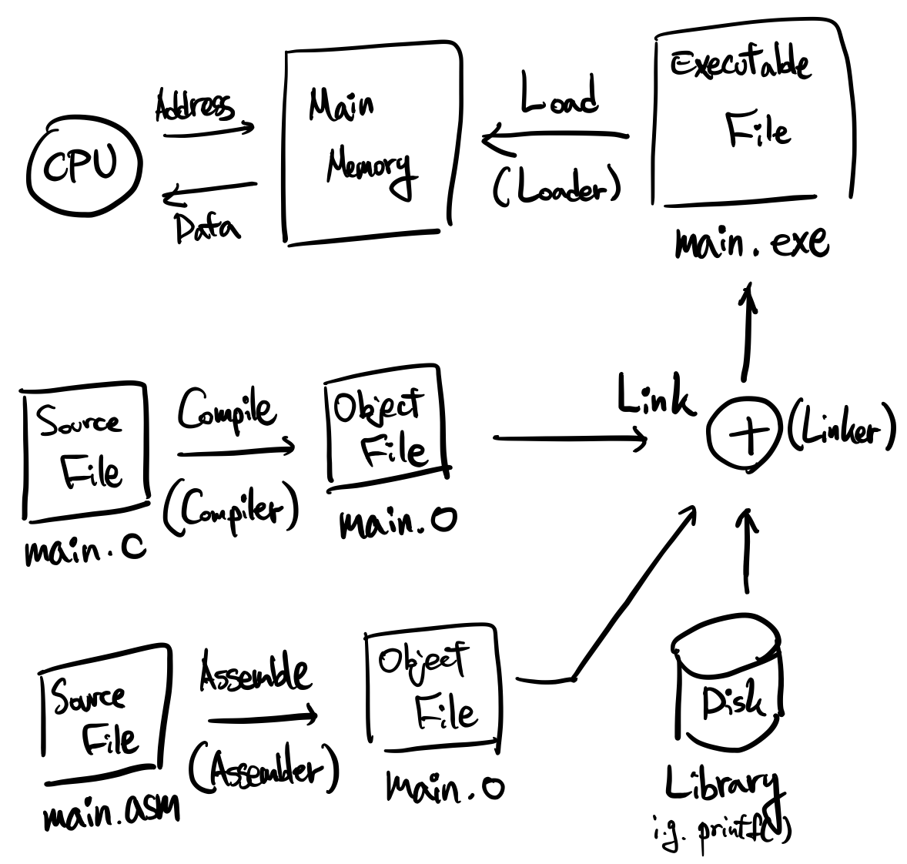
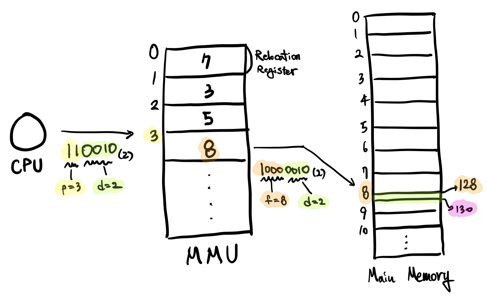

### 목차

1. [메모리의 역사](#1-메모리의-역사)
2. [메모리의 주소, Address of Memory](#2-메모리-주소)
   1. 프로그램 개발
   2. MMU, Main Memory Unit
3. [메모리 낭비 방지](#3-메모리-낭비-방지)
   1. 동적 적재, Dynamic Loading
   2. 동적 연결, Dynamic Linking
   3. 스와핑, Swapping
4. [메모리 연속 할당](#4-연속-메모리-할당)
   1. 연속 메모리 할당 방식
   2. 연속 메모리 할당의 문제점
5. [페이징, Paging](#5-페이징-Paging)
   1. 주소 변환, Address Translation
   2. 페이징의 작은 문제점
   3. 페이지 테이블, Page Table
6. [세그멘테이션, Segmentation](#6-세그멘테이션-Segmentation)
   1. 외부 단편화, External Fragmentation

<br>

<a href="https://github.com/jarvis08/Reminders">메인으로</a>

<br>

# 1. 메모리의 역사

- 메모리 종류

  - Core Memory

    자성을 이용하여 사용했던 메모리이며, 플레밍의 오른손 법칙에 의해 전자기장을 형성하여... 으악!

  - 진공관 메모리

    50~60년대의 메모리

  - 트랜지스터 메모리

  - **집적회로 메모리, SRAM, DRAM**

    현재의 메모리

- 메모리의 용량
  - 1970년대
    - 8-bit PC
    - 64KB Memory
  - 1980년대

    - 16-bit IBM-PC
    - 640KB ~ 4MB Memory
  - 1990년대
    - 수MB ~ 수십MB Memory
  - 2000년 ~ 현재
    - 수백MB ~ 수십GB Memory

<br>

### 현재도 부족한 메모리

- 사용 언어의 변화
  1. 기계어/어셈블리어
  2. C언어
  3. 객체 지향형 언어

- 타겟의 변화
  1. 숫자 처리
  2. 문자 처리
  3. 멀티미디어 처리
  4. 빅데이터

메모리의 가용 용량이 증가했지만, **프로그램의 크기 또한 증가**했기 때문에 메모리는 언제나 부족합니다. 따라서 **메모리의 낭비**를 없애야 하며, **가상 메모리(Virtual Memory)**를 활용하여 메모리의 부족을 최소화해야 합니다.

<br>

<a href="#목차" style="text-align: right;">맨 위로</a>

<br>

# 2. 메모리 주소

**CPU**는 `주소(Address)`를 Main Memory에 전송하고, **Main Memory**는 해당 주소에 존재하는 `Data`를 CPU에게 반환합니다.

<br>

<br>

## 2-1. 프로그램 개발

- 원천 파일, Source File
  - **High Level Language**(i.g., C, C++, Java)
  - **Assembly Language**
- 목적 파일, Object File
  - **Compiler**에 의한 **Compile**의 결과물
  - **Assembler**에 의한 **Assemble**의 결과물
- 실행 파일, Executable file
  - **Linker**에 의한 **Link**의 결과물
  - **Loader**가 **Executable File**을 Main Memory에 **Load**

<br>

### 프로그램 실행

프로세스의 메모리 = `Code` + `Data` + `Stack`

- `Stack`
  1. 함수 호출 시 돌아와야 할 주소를 저장
  2. Local Variable 저장

<br>

<br>

## 2-2. MMU, Main Memory Unit

기본적인 MMU의 구성입니다.

- **Base Register**

  프로세스가 시작되는 주소값을 저장

- **Limit Register**

  프로세스가 시작되는 주소값을 저장

- **Relocation Register**

  CPU가 보유하고 있는 Process의 주소와 실제 메인 메모리의 주소를 연결하는 레지스터


<br>

### 주소 구분

주소를 **논리 주소(Logical Address)**와 **물리 주소(Physical Address)**로 구분합니다.

- 논리 주소, Logical Address
  - CPU가 사용하는 주소
  - CPU는 Main Memory에 논리 주소를 전송하여 데이터를 요청
- 물리 주소, Physical Address
  - 실제로 Main Memory에서 사용하는 주소
  - CPU가 전송한 논리 주소는 MMU에 의해 Relocate되어 물리 주소로 사용됨

<br>

### 논리 주소와 물리 주소로 구분되는 이유

CPU는 프로세스를 작업하면서 언제나 같은 작업에 대해서는, 언제나 같은 주소로 메인 메모리에게 데이터를 요청합니다. 하지만 메인 메모리에 적재된 프로세스의 주소는 언제나 다를 수 밖에 없습니다. **같은 프로세스를 실행할 지라도, 아까 적재했던 주소값에는 다른 프로세스가 적재되어 있을 수 있습니다**. 따라서 MMU는 CPU에게 적절한 데이터를 반환하기 위해 **Relocation Register**를 사용하여 **Address Translation**을 진행합니다.

<br>

<a href="#목차" style="text-align: right;">맨 위로</a>

<br>

# 3. 메모리 낭비 방지

메모리의 낭비를 방지할 수 있는 방법으로 세 가지가 있습니다.

1. 동적 적재, Dynamic Loading
2. 동적 연결, Dynamic Linking
3. Swapping

<br>

<br>

## 3-1. 동적 적재, Dynamic Loading

동적 적재는 프로그램 실행에 **반드시 필요한 Routine 및 Data 만을 적재**하는 방법입니다.

우리가 제작한 프로그램에는 실행하는데 있어서 필수적이지 않은 루틴 및 데이터도 존재합니다. 필수적이지 않은 루틴의 예로는 예외 처리가 있으며, 데이터의 경우 의미 없이 만들어진 배열이 있을 수 있습니다. 하지만 당장 필요하지 않다 해서 영원히 필요하지 않은건 아니므로, **필요할 경우 그 때 해당 부분을 메모리에 로드**합니다.

동적 적재의 반대 용어로는 **정적 적재(Static Loading)**이 있으며, 정적 적재는 필요 여부와 상관 없이 모든 내용을 로드합니다.

<br>

<br>

## 3-2. 동적 연결, Dynamic Linking

여러 프로그램에 공통적으로 사용되는 공통 라이브러리 루틴(Common Library Routine)을 메모리에 중복으로 올리는 것은 낭비입니다. 원래 실행 파일을 제작하기 이전에 필요한 라이브러리를 링크하지만, 공통되는 라이브러리 루틴은 오직 하나만 메모리에 로드한 채 나머지는 존재하는 루틴에 링크하여 사용합니다.

공통 라이브러리 루틴의 예로 printf(), Network Library, Sound Library 등이 있습니다. 동적 연결의 반대 용어는 **정적 연결(Static Linking)**입니다.

<br>

### 운영체제 별 용어

 운영체제 별로 다른 용어를 사용하기도 합니다.

- Linux - 공유 라이브러리, Shared Library
  - 확장자: `.so`
  - Shared Object
- Windows - 동적 연결 라이브러리, Dynamic Linking Library
  - 확장자: `.dll`

<br>

<br>

## 3-3. 스와핑, Swapping

메모리에 적재되어 있으나, **현재 사용되지 않고 있는 프로세스 이미지**를 보조 기억장치의 Backing Store(Swap Device)로 몰아냅니다. 몰아내는 것은 **Swap-out**이라고 하며, 다시 메모리에 적재시키는 것을 **Swap-in**이라고 합니다.

물론 MMU의 Relocation Register의 사용으로 swap 전후 주소 차이는 작업에 지장을 주지 않습니다만, **프로세스 크기가 크면 swap 작업의 오버헤드가 크게 발생**합니다.

<br>

<a href="#목차" style="text-align: right;">맨 위로</a>

<br>

# 4. 연속 메모리 할당

**연속 메모리 할당(Continuous Memory Allocation)**은 프로세스를 연속된 메모리 공간에 할당하는 방식입니다. 즉, 프로세스 하나의 모든 내용은 그것들끼리 연속되는 메모리 공간에 함께 적재되어 있습니다.

<br>

<br>

## 4-1. 연속 메모리 할당 방식

연속 메모리 할당에는 세 가지 방법이 있습니다.

- 최초 적합, First-fit

  메모리의 위/아래에서 시작하여 프로세스가 적재될 수 있는, 최초로 발견된 공간에 적재합니다.

- 최적 적합, Best-fit

  공간 크기가 최대한 비슷한 곳에 적재합니다.

- 최악 적합, Worst-fit

  공간 크기 차이가 가장 큰 곳에 적재합니다.

<br>

### 할당 방식 성능 비교

- 가장 빠른 할당 속도: First-fit

- 메모리 공간 이용률: First-fit, Best-fit

  공간 이용률은 두 방식이 대부분 유사합니다.

<br>

<br>

## 4-2. 연속 메모리 할당의 문제점

우리가 보통 사용하는 다중 프로그래밍 환경을 고려해 보겠습니다. 부팅 직후의 메인 메모리에는 운영체제를 제외한 나머지 공간에는 아무 프로세스도 적재되어 있지 않습니다(big single hole).

하지만 컴퓨터를 사용하면서, 여러 프로세스들을 생성하고 종료하기를 반복하다 보면 메모리 안에는 빈 공간과 사용중인 공간이 흩어져서 존재(scattered holes)하게 됩니다. 이 때, hole 들이 불연속하게 흩어져 있는 현상을 **메모리 단편화(Memory Fragmentation)**라고 부르며, 정확히는 **외부 단편화(External Fragmentation)**라고 합니다. 외부 단편화가 발생하면, 사용되지 않는 메모리 공간의 크기가 충분하더라도 프로세스를 할당할 수 없는 상황이 발생합니다.

외부 단편화로 인해 메모리 공간의 1/3 수준을 활용하지 못하게 됩니다.

<br>

### 해결 방법, Compaction

Scattered Holes를 한 곳으로 모으는 작업입니다. 하지만 실행 중인 프로세스들을 다른 공간으로 밀어내는 작업에는 큰 오버헤드가 발생하며, 최적 알고리즘이 존재하지 않기 때문에 **해결 방법이라고 표현할 수 없습니다.**

보다 해결 다운 해결을 위해 **페이징(Paging)** 기법을 사용합니다.

<br>

<a href="#목차" style="text-align: right;">맨 위로</a>

<br>

# 5. 페이징, Paging

프로세스와 메인 메모리의 공간을 **일정 크기**로 잘라서 관리합니다. 프로세스를 나누는 단위를 **페이지(Page)**라고 하며, 메모리 공간을 나누는 단위를 **프레임(Frame)**이라고 하고, **페이지와 프레임의 크기**는 같습니다. 보조 기억 장치에서 프로세스를 메인 메모리로 로드할 때, 프로세스를 페이징하여 페이지를 프레임에 할당하게 됩니다.

페이지를 프레임에 할당하는 작업에 있어서, 이전 4-2-3에서 언급했었던 MMU의 **Relocation Register**가 중요한 역할을 합니다. 프로세스의 각 페이지들은 각각의 Relocation Register를 통과하여 각각의 프레임 주소로 할당됩니다. 여기서 MMU는 여러 Relocation Register들이 합쳐진 **페이지 테이블(Page Table)**이 됩니다.

<br>

## 5-1. 주소 변환, Address Translation

CPU는 메인 메모리로 논리 주소(Logical Address)를 전송하는데, 전송하는 과정에 MMU를 거치면서 물리 주소(Physical Address)로 변환됩니다. 물리 주소는 보조 기억장치로부터 아무렇게나 올려진 메모리 조각들을 찾아 다닐 수 있습니다.

<br>

### 주소의 구성

- **논리 주소**
  - `p`: 페이지 테이블의 번호
  - `d`: 변위(=오프셋), Displacement(=Offset)

- **물리 주소**
  - `f`: 메인 메모리의 번호
  - `d`: 논리주소의 `d`와 동일한 값

<br>

### `p`와 `d`의 크기

CPU가 보내는 주소를 2진수로 표현했을 때, 이는 총 `m` bit 입니다. 그 중 하위에 존재하는 `n` bit는 `d`(Displacement) 역할을 하며, 주소 상위의 `m-n` bit는 `p`(페이지 번호) 역할을 합니다.

<br>

### 예시

- 가정
  - 페이지 크기 = 16 Byte
  - 논리 주소 = 50

16 = 2^4이므로, `n = 4`입니다. 만약 페이지 크기가 1 KB라면 `n` 값은 `10`입니다.

CPU에서 전송한 주소는 50이며, 50을 이진수로 표기하면 `110010`(이진수)입니다. 따라서 `n` 개의 이진수로 표시되는 `d` 값은 `0010`(이진수)이며, `m-n` 개의 이진수로 표시되는 `p` 값은 `11`(이진수)인 `3`(10진수)입니다.


`p` 값은 페이지 테이블의 주소값이며, 페이지 테이블 주소의 값으로 변환됩니다. `p`로 부터 변환된 `f` 값은 `8`이며, 물리적 주소는 `10000010`(이진수)가 됩니다. 물리적 주소는 `d`와 `p`를 분리하여 계산하지 않으며, 해당 값의 주소인 `130`으로 직접 접근합니다.



<br>

<br>

## 5-2. 페이징의 작은 문제점

### 내부 단편화, Internal Fragment

내부 단편화란, **프레임이 가득차지 않아 발생하는 Memory Loss**를 말합니다. 페이지 사이즈 및 프레임 사이즈가 16 byte라고 가정했을 때, 만약 프로세스의 마지막 페이지가 1 byte일 경우 15 byte라는 프레임 공간이 낭비되게 됩니다.

물론 메모리에 낭비 공간이 생성되지만, 최대 낭비 공간이 `Frame size - 1`이며 영향력이 크지 않습니다.

<br>

<br>

## 5-3. 페이지 테이블, Page Table

### 페이지 테이블의 저장 공간

페이지 테이블을 구성할 수 있는 공간에는 세 곳이 있습니다.

1. **CPU Register**

   CPU의 기억 장치인 Register에 구성합니다.

   - 장점: 빠른 속도
   - 단점: 매우 제한된 저장 공간

2. **Main Memory**

   Main Memory의 OS 영역에 저장합니다.

   - 장점: 모든 **테이블 엔트리**를 저장할 수 있는 충분한 공간
   - 단점: 왕복 2회의 처리(메모리 주소를 알기 위한 메모리 접근)가 필요하여 속도 저하

3. **TLB, Translation Look-aside Buffer**

   High Speed SRAM으로 별도의 SRAM Chip을 구성합니다.

   **현재의 운영체제들이 사용하는 방법**입니다.

   - 장점: Main Memory 보다 빠른 처리 속도, CPU의 Register 보다 여유로운 용량

<br>

### Hit Ratio

Page Table은 일부만 MMU에 존재하며, 나머지는 OS 메모리 영역에 존재합니다. 만약 필요한 Relocation Register가 MMU에 존재하지 않을 경우 OS 메모리 영역에서 탐색합니다.

CPU가 논리 주소를 MMU에 전송했을 때, **필요한 Relocation Register가 MMU에 존재하여 바로 응답할 수 있는 비율**을 Hit Ratio라고 합니다. 현재 우리가 사용하는 OS의 경우, Hit Ratio는 주로 95% 이상입니다.

<br>

### TLP 사용 시 유효 메모리 접근 시간(Effective Memory Access) 계산

- `Tm`: 메인 메모리를 읽는 시간
- `Tb`: Look-aside Buffer
- `h`: Hit Ratio 

```
Tm = 100ns
Tb = 20ns
h = 80%
Teff = h * Tb + (1-h) * (Tb + Tm)
```

<br>

### 페이지 테이블의 기능 - 보호, Protection

페이지 테이블은 해킹과 같은 나쁜 프로세스의 시도로부터 컴퓨터를 보호하는 기능을 수행합니다.

보호 기능은 MMU를 거쳐야만 메모리에 접근할 수 있습니다. 그리고 MMU에는 페이지 테이블 엔트리 마다 `r`, `w`, `x` 세 가지 비트가 있습니다.

- `r`: Reader
- `w`: Writer
- `x`: Executer

아래는 페이지 테이블과 보호 기능에 대한 예시입니다.

| Page Number | Frame Number | r    | w    | x    |
| ----------- | ------------ | ---- | ---- | ---- |
| 0           | 8            | 1    | 0    | 0    |
| 1           | 3            | 0    | 0    | 1    |

첫 번째 열의 주소는 메모리를 읽을 수 있는 권한은 있지만, 쓰거나 실행하려는 경우 Interrupt가 발생되어 프로세스가 종료됩니다. 두 번째 열의 주소는 메모리의 프로세스를 실행할 수 있는 권한이 있지만, 읽거나 쓰려고 시도하면 Interrupt가 발생합니다.

<br>

### 페이지 테이블의 기능 - 공유, Sharing

페이지 테이블은 메모리의 낭비를 일부 방지할 수 있는 기능이 있습니다.

같은 프로그램을 쓰는 복수 개의 프로세스가 있다고 가정해 봅시다. 그 예로 Web Browser, Word Processor 등을 동시에 여러 개 작업하는 경우들이 있습니다.

프로세스는 메모리 공간을 (Code, Data, Stack)으로 나누어서 사용합니다. 그런데 어떤 프로그램들은 복수 개로 별도 실행하고, 다른 작업들을 할 지라도 동일한 **Code** 내용을 사용할 수 있습니다. 이러한 경우 메모리 상에 Code 내용이 세 곳에 저장하지 않고, 페이지 테이블에서 동일한 Frame Number를 사용한다면 중복되는 Code 내용을 없앨 수 있습니다.

하지만 프로그램 중복 실행 시 Code 영역이 달라지지 않는 **non-selfmodifying code**(=**reentrant code**)(=**pure code**), **코드 실행 시 스스로 내용이 달라지지 않는 코드**일 경우에만 공유 기능이 사용됩니다.

<br>

<a href="#목차" style="text-align: right;">맨 위로</a>

<br>

# 6. 세그멘테이션, Segmentation

**Paging**은 프로세스 내부의 **논리적 내용과는 무관하게, 일정한 고정된 크기**로 프로세스 이미지를 분할합니다. 그리고 페이지 테이블을 거쳐 메인 메모리에 접근하므로, 보호 기능과 공유 기능이 있음을 알 수 있습니다.

그런데 무관된 분할로 인하여 데이터 접근이 곤란해질 수 있습니다. 프로세스는 Code, Data, Stack의 형태로 메인 메모리에 로드됩니다. Code 부분을 분할하던 중, **페이지의 공간이 남아** Data를 일부 포함시키는 상황이 발생할 수 있습니다. 만약 Code 부분에 대해서는 `r` 권한을 갖고 있으며, Data에 대해서는 `w` 권한만을 가지고 있다면 이는 어떻게 해야 할까요?

이러한 문제를 해결해줄 수 있는 방법은 **세그멘테이션(Segmentation)**입니다. 세그멘테이션은 **프로세스를 논리적 내용(=세그멘트)으로 분할하여 메모리에 배치**합니다. 따라서 세그먼트들 끼리의 크기는 일반적으로 같지 않습니다.

페이징과 마찬가지로 **보호(Protection)**와 **공유(Sharing)** 효과가 있으며, 심지어 그 성능이 더 우수합니다. 위에서는 보호 효과에 대해 왜 세그멘테이션이 더 우수한가에 대해 설명드렸으니, 공유 효과에 대해 생각해 보겠습니다. 공유란 프로세스 별로 일정 부분을 공유하여 메모리 낭비를 방지하는 효과입니다. 그런데 **페이지를 공유할 경우, 의도하지 않은 프로세스의 부분들이 공유**될 수 있습니다. 하지만 논리적 내용으로 구분된 세그멘테이션의 경우 정확하게 원하는 내용만을 공유할 수 있습니다.

<br>

### 세그먼트 테이블, Segment Table

세그먼트 테이블과 페이지 테이블의 역할들 중 공통점은 다음과 같습니다.

- MMU 내의 **재배치 레지스터(Relocation Register)** 값을 통해 주소를 변경한다.

- CPU는 프로세스가 연속된 메모리 공간에 위치한다고 착각하며,

  그러한 형태와 동일하게 주소를 사용할 수 있다.

차이점은 다음과 같습니다.

- 페이지 테이블
  - Relocation Register에 메모리 번호(**프레임 번호**)를 보유하고 있다.
- 세그먼트 테이블
  - 메모리의 **Base Address**와 **Limit Address**를 보유하고 있다.

이러한 차이가 발생하는 이유는 세그멘테이션은 프레임(Frame)을 사용하지 않기 때문입니다. 프레임은 페이지와 같은 사이즈로 메인 메모리 공간을 분할하여 끼워 맞추기 위해 사용됩니다.

하지만 세그멘테이션의 경우 프로세스의 구성 별로, 세그먼트 별로 그 크기가 다르기 때문에 미리 예측된 공간인 프레임에 할당할 수 없습니다. 따라서 지정된 번호가 아니라, 직접 시작 주소와 종료 지점을 Relocation Register에 등록해 두어야 합니다.

<br>

<br>

## 6-1. 외부 단편화, External Fragmentation

### 현재 사용되는 방법

그렇다면 현재 우리가 주로 사용하는 운영체제들은 어떤 방법을 사용하는지 알아보겠습니다.

- Paging
  - Windws
  - Linux
- Segmentation
  - OS/2

분명 Segmentation이 더 우수한 효과가 있다고 공부했는데 왜 사용되지 않는 걸까요? 그 이유는 세그멘테이션에는 치명적인 단점이 있습니다.

<br>

### 세그멘테이션의 단점

세그멘테이션은 일부에서는 페이징보다 우수한 기능을 수행하지만, 페이징에는 없는 치명적인 단점이 있습니다. 페이징과 세그멘테이션을 사용하는 1차적인 목표는 **메인 메모리 낭비 제거**입니다. 하지만 논리적인 내용을 토대로 공간을 분할하다 보니, 세그멘트 별 크기가 가변적입니다. 따라서 연속 할당을 했을 때와 같은 문제인 **외부 단편화(External Fragmentation)**가 발생하며, First-fit/Best-fit/Worst-fit/Compaction과 같은 방안을 다시 고려해야 합니다.

<br>

### 해결 방안, Paged Segmentation

세그멘테이션의 보호 기능과 공유 기능을 살리면서, 페이징의 외부 단편화 문제 해결을 하고자 고안된 것이 바로 '**세그멘트들을 페이징**'하는 방법입니다. Paged Segmenatation은 파워와 속도를 Trade-off한 것으로, Translation 과정은 다음과 같습니다.

`CPU` - `Segment Table` - `Page Table` - `Main Memory`

거쳐야 할 테이블의 수가 늘어 속도는 조금 줄었지만, 두 가지 방법의 장점을 모두 살릴 수 있는 방안입니다.

<br>

### 현대의 OS들은 어떻게 사용하나?

[stackoverflow](https://stackoverflow.com/questions/24358105/do-modern-oss-use-paging-and-segmentation)

Paging만을 사용하며, Segmentation은 잘 사용하지 않는다.

