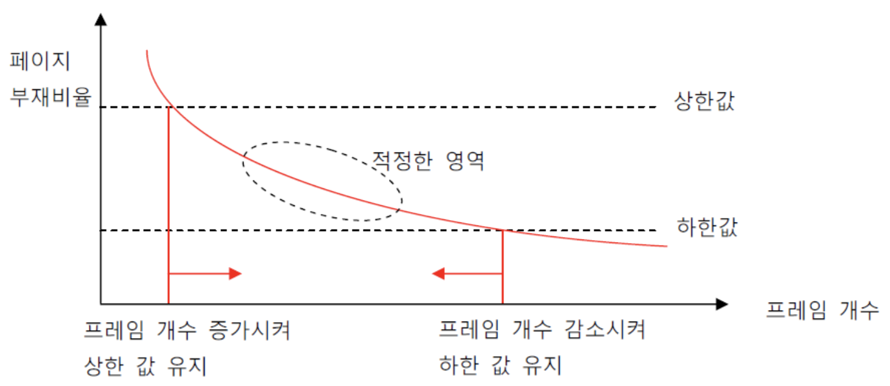

### 목차

1. [가상 메모리, Virtual Memory](#1-가상-메모리-Virtual-Memory)
   1. 요구 페이징, Demand Paging
2. [페이지 교체, Page Replacement](#2-페이지-교체-Page-Replacement)
   1. Victim Page
   2. 페이지 교체 알고리즘
3. [프레임 할당, Frame Allocation](#3-프레임-할당-Frame-Alloaction)
   1. 쓰레싱, Thrashing
   2. 정적 할당, Static Allocation
   3. 동적 할당, Dynamic Allocation
4. [페이지 크기, Page Size](#4-페이지-크기-Page-Size)
   1. 페이지 크기 증가의 효과
   2. 페이지 테이블의 변화

<br>

<a href="https://github.com/jarvis08/Reminders">메인으로</a>

<br>

# 1. 가상 메모리, Virtual Memory

만약 실제로 우리가 보유하고 있는 물리 메모리 보다 크기가 큰 프로세스를 실행하면 어떻게 될까요?

우리는 가상 메모리를 통해 아주 큰 프로그램도 실행할 수 있습니다. 프로세스 이미지를 모두 메인 메모리에 적재하는 것이 아니라, **현재 실행하는 데에 필요한 이미지 만을 메모리에 부분적으로 로드**할 수 있습니다.

현재의 실행에 필요하지 않은 메모리로는 오류 처리, 일부 데이터 등이 있을 수 있습니다. 만약 프로그램이 워드프로세스라면, 정렬이나 표와 같은 기능들은 실행되지 않을 가능성 또한 있습니다. 이는 앞서 배웠던 4-3-1의 동적 적재(Dynamic Loading)와 비슷한 개념입니다.

<br>

<br>

## 1-1. 요구 페이징, Demand Paging

요구 페이징이란, 당장 요구되는, 당장 필요한 페이지만을 로드하는 페이징 방법입니다. 당장 필요하지 않은 페이지들은 Backing Store(=Swap Device)에 저장되어 있으며, 필요시 마다 로드합니다.

<br>

### Valid Bit

요구 페이징을 구현하기 위해서는 현재 작업하고자 하는 프로세스의 페이지가 로드 되어 있는지, 혹은 앞으로 로드해야 하는지를 확인할 수 있어야 합니다. 이를 위해 MMU에 Valid bit를 추가합니다. Valid bit는 현재 로드되어 있는 프로세스 페이지는 `1`, backing store에 있는 페이지는 `0`으로 표현합니다.

<br>

### 페이지 결함, Page Fault

현재 접근하려는 페이지가 메모리에 없는 상태(Invalid)이자, valid bit가 `0`인 상황입니다.

<br>

### 요구 페이징의 과정


<br>

### Pure Demand Paging

프로그램을 로드하는 순간 부터 페이지 결함을 발생시킵니다. 즉, 프로그램을 로드하는 작업을 제외하면 특정 페이지를 요청하기 전 까지 아무런 페이지도 로드해 놓지 않습니다.

정말 필요로 하는 페이지들 만을 로드하기 때문에 메모리를 꼭 필요한 만큼만 사용합니다. 하지만, 모든 작업을 수행하며 페이지 결함이 발생하고, 새 페이지를 로드하는 작업이 필요하기 때문에 작업 속도가 느려집니다. 주의할 점은 I/O는 CPU의 작업 속도에 비해 매우 느리므로, backing store를 자주 조작하는 pure demand paging은 더욱 느릴 수 밖에 없습니다.

<br>

### Prepaging

프로그램 제작자가 미리 필요한 페이지들을 선정하여 자동으로 로드되게끔 합니다.

<br>

### 유효 접근 시간, Effective Access Time

유효 접근 시간이란, 평균적인 접근 시간을 말합니다.

- `p`: Page fault rate
- `Tm`: 메모리를 읽는 시간
- `Tp`: 페이지 결함 시 소요되는 시간
  - Seek time: 목표 track으로 header를 움직이는 시간
  - Rotational delay: 디스크가 회전하며 자기 신호(Data)를 생성하는 시간
  - Transfer: 데이터를 전송하는데 걸리는 시간

```
Teff = (1-p)Tm + pTp
```

`p = 0.001`일 때 `Teff = 8.2 usec` 이며, 이는 결함이 없는 경우 보다 약 40배 느립니다.

`p = 1 / 40만`일 경우 `Teff = 220nsec` 이며, 이는 40만 회에 결함이 1회 발생하는 경우로, 결함이 없을 때 보다 10% 느립니다.

이렇듯 한 번 결함이 발생하는 것 조차 처리 속도에 큰 영향을 미치게 됩니다.

<br>

### 지역성의 원리, Locality of Reference

메모리의 접근은 **시간적, 공간적 지역성**을 가집니다.

**보통 한 번 실행됐던 메모리의 내용이 그렇지 않은 메모리 보다 더 자주 사용**되며, 페이지 로드 시 **Block 단위로 로드**하므로, **주변의 내용도 같이 로드**됩니다. 따라서 실제로 페이지 부재 확률은 매우 낮습니다.

<br>

### 기타 해결 방안

HDD는 접근 시간이 너무 오래 걸리므로, SSD(Solid State Disk) 혹은 저가형 DRAM을 Swap device로 사용하면 보다 빠르게 작업할 수 있다.

<br>

<a href="#목차" style="text-align: right;">맨 위로</a>

<br>

# 2. 페이지 교체, Page Replacement

아무리 필요한 페이지만을 메인 메모리에 로드하더라도, 언젠가는 메모리가 가득 차게 됩니다. 메모리가 가득 찬 상황이며, 추가적인 페이지를 메모리로 로드하고자 한다면, 로드 되어 있는 페이지를 backing store로 보내버린 후, 새로 사용할 페이지를 만들어 낸 빈 메모리 공간에 로드해야 합니다.

여기서 backing store로 페이지를 보내버리는 작업을 **Page-out**이라고 하며, 로드해 오는 작업을 **Page-in**이라고 합니다. 그리고 backing store로 보내지는 페이지를 **Victim Page**라고 부릅니다.

<br>

## 2-1. Victim Page

CPU는 어떤 페이지를 backing store로 보내야 효율적으로 작업할 수 있을 지 결정해야 합니다. 여기서 중요한 것은 최대한 **수정되지 않은 페이지를 Victim Page로 선정하는 것**입니다.

만약 메모리로 로드하기 이전과 비교했을 때 아무런 수정이 이루어지지 않은 파일을 backing store로 page-out하게 되면, backing store 내부에서 writing 할 일이 없습니다. 우리가 생각해야 할 것은 **I/O의 작업 처리 속도는 CPU의 속도 보다 매우 느리다**는 것입니다. 만약 수정이 이루어진 페이지라면, 해당 페이지의 수정 내용을 I/O 내부적으로 적용하는 작업이 필요하기 때문에 수정되지 않은 페이지를 page-out 하는 것이 효율적입니다.

<br>

### Modified Bit

페이지가 수정됐는지, 수정되지 않았는지 판단하는 작업은 또 다시 MMU가 수행해 줍니다. 5-1-1의 Valid Bit과 같이 **Modified Bit**을 설정하여 수정 여부를 표시합니다. 과거에는 **Dirty Bit**이라고 불렸습니다.

| Frame Number | Valid Bit | Modified Bit |
| ------------ | --------- | ------------ |
| 6            | 1         | 0            |
| 5            | 1         | 1            |

위의 표가 MMU의 일부라고 했을 때, 첫 번째 행의 Relocation Register는 6번 Frame으로 주소를 변환 시킵니다. 현재 Main Memory에 존재하고 있으며, 수정되지 않아 Backing Store의 Load 이전의 내용과 동일합니다.

하지만 두 번째 행의 재배치 레지스터의 경우 메인 메모리에 존재하지만, 수정되어 있어 Page-out 시 writing 작업이 필요합니다.

<br>

<br>

## 2-2. 페이지 교체 알고리즘

여러 페이지들 중 어떤 페이지를 Victim Page로 설정하는가에 대한 방법들입니다. 페이지 교체 알고리즘들을 알아보기에 앞서, 각 알고리즘들이 사용하는 페이지 참조 열(Page Reference String)에 대해 알아보겠습니다.

<br>

### 페이지 참조 열, Page Reference String

MMU는 바이트로 표현되는 논리 주소로 부터 필요한 페이지가 무엇인지 알아내야 하며, 그 과정은 다음과 같습니다.

`논리 주소 -> 페이지 번호 -> 페이지 참조 열`

페이지 사이즈가 100 byte이며, CPU가 요구하는 주소들이 다음과 같다고 해 봅시다.

```
100, 101, 102, 432, 612, 103, 104, 611, 612
```

페이지 사이즈가 100이므로, 주소들의 페이지 번호는 다음과 같습니다.

```
1, 1, 1, 4, 6, 1, 1, 6, 6
```

지역성의 원리(Locality of Reference)로 인해 100에 해당하는 페이지를 로드할 때에는 199까지의 내용까지 함께 로드 됩니다. 그러므로 101과 102를 요구할 때에는 Page Fault가 발생하지 않으며, 참조해야 하는 페이지의 순서 열이 다음과 같습니다.

```
1, 4, 6, 1, 6
```

<br>

### Replacement 대상

- **Global Replacement**: 메모리 상의 모든 프로세스들의 페이지들을 교체 대상으로 합니다.
- **Local Replacement**: 메모리 상의 모든 프로세스들 중, 자기 자신의 페이지들만을 교체 대상으로 합니다.

<br>

### 페이지 교체 알고리즘의 종류

1. FIFO, First-In First-Out
2. OPT, Optimal
3. LRU, Least-Recently-Used

<br>

### 1) FIFO, First-In First-Out

계속해서 가장 빠른 시점에 로드 됐었던 페이지를 Page-out 합니다. 메모리의 크기가 증가하면 Page Fault가 계속해서 줄어들 것이라 생각되지만, 사실상 **Belady's Anomaly**에 의하면 그렇지 않습니다.

Belady's Anomaly는 FIFO 방식의 페이지 교체 알고리즘을 사용할 때, 프레임의 수(메모리 용량)이 증가하지만, 특정 구간에서 PF(Page Fault) 횟수가 증가하는 현상을 말합니다. 이러한 현상으로 인해 무작정 메모리의 크기를 늘린다고 해서 효율이 줄어드는 효과가 무조건적으로 발생하지는 않습니다.


<br>

### 2) OPT, Optimal

가장 오래동안 사용되지 않을 페이지를 Page-out 합니다. 설명이 다소 이상하게 들리실 수 있습니다. 하지만 말 그대로, 미래까지 예측할 수 있어야 가능한 방법이며, SJF CPU Scheduling Algorithm과 같이 현실적으로 사용기 어렵습니다.

<br>

### 3) LRU, Least-Recently-Used

과거 이력을 봤을 때, 가장 오래동안 사용되지 않은 프로세스를 Page-out 합니다. 이는 최근에 사용되지 않았다면, 나중에도 사용되지 않을 것이라는 예상에 기반을 합니다.

<br>

<a href="#목차" style="text-align: right;">맨 위로</a>

<br>

# 3. 프레임 할당, Frames Allocation

CPU Utilization(활용률)과 Degree(차수) of Multi-Programming의 관계에 대해 알아보겠습니다. 다시 말하자면, 메모리에 올리는 프로세스의 개수(동시에 처리하는 개수)가 많아질 수록 CPU의 활용률이 증가하는가에 대해 알아보겠습니다.

<br>

## 3-1. 쓰레싱, Thrashing

얉게 생각해 보자면, 동시에 여러 프로세스를 처리할 수록 CPU를 많이 사용하는 것이며, 효율적으로 일들을 처리하여 빠르게 작업을 수행할 수 있습니다. 하지만 우리가 사용하는 PC는 그렇지 않습니다. CPU의 작업 처리 속도는 매우 빠르지만, **I/O이자 Backing Store인 하드 디스크의 읽기/쓰기 속도는 비교적 매우 느립니다**. 따라서 페이지 교체가 일어날 경우 작업 속도의 저하를 야기하며, Multi-Programming의 차수가 일정 이상 증가하게 되면 페이지 교체가 너무 빈번하게 일어나게 되어 오히려 작업 속도를 감소됩니다.

**메모리의 크기는 한정**되어 있으며, 멀티 프로그래밍이 활발해질 경우 **프로세스 당 사용할 수 있는 프레임의 개수는 더욱 제한**되므로 페이징 교체의 증가는 막을 수 없습니다. 이러한 이유들로 인해 오히려 CPU Utilization이 감소하는 현상을 **Thrashing**이라고 합니다.


<br>

### 쓰레싱 극복 방법

쓰레싱을 극복하려면 **프로세스 별로 충분한, 그리고 적절한 수의 프레임이 할당되어야 합니다**. 그렇지 않으면, **Context Switching**이 발생할 때 마다 자신에게 필요한 프로세스 페이지들을 로드하기 위해 다른 프로세스의 페이지들을 아웃 시킬 것입니다. 따라서 Global Replacement 보다는 **Local Replacement**가 쓰레싱 극복에 유리합니다.

프로세스 별로 프레임을 할당하는 방법에는 다음과 같은 방법들이 있습니다.

- 정적 할당, Static Allocation
  - 균등 할당, Equal Allocation
  - 비례 할당, Proportional Allocation
- 동적 할당, Dynamic Allocation
  - Working Set Model
  - PFF, Page Fault Frequency

<br>

<br>

## 3-2. 정적 할당, Static Allocation

정적 할당은 프로세스를 로드할 때 할당 받을 프레임의 개수를 결정합니다.

<br>

### 균등 할당, Equal Allocation

프로세스의 활용도, 크기와 상관 없이 모든 프로세스들에게 동일한 개수의 프레임을 할당합니다.

<br>

### 비례 할당, Proportional Allocation

프로세스 별로 크기에 비례하여 프레임들을 할당합니다.

```
P1 프레임 = P1 / (P1 + P2 + P3)
P2 프레임 = P2 / (P1 + P2 + P3)
P3 프레임 = P3 / (P1 + P2 + P3)
```

<br>

<br>

## 3-3. 동적 할당, Dynamic Allocation

그런데 프로세스의 크기가 크다고 프레임을 많이 할당하는 것이 효율적인 방법은 아닐 수 있습니다. 어떤 프로세스는 다른 프로세스들 보다 오랫동안 실행될 수 있으며, 그렇다면 이 프로세스에 더 많은 프레임을 할당하는게 더 효율적일 것입니다. 그리고 이러한 관점에서 동적 할당을 고려했을 때, 대표적인 할당 방법으로 Working Set Model과 PFF(Page-Fault Frequency) 알고리즘이 있습니다.

<br>

### Working Set Model

시간과 참조(Reference, CPU가 참조하는 Page Number)의 그래프를 그려봤을 때, 시간대 별로 Locality를 만족하는 프레임들이 사용됨을 확인할 수 있습니다. 즉, 서로 유사한 페이지 군을 각 시간대 별로 사용합니다. 따라서 이런 Locality를 만족시키는 프레임들 만을 할당하는데, 미래를 예측할 수는 없으므로, **과거에 사용했었던 기록을 토대로 작업군을 선정하는 방법**이  바로 **Working Set Model** 입니다.

얼마간의 과거 기록을 참고할 것인지를 결정하는 요소는 **Working Set Window** 입니다.

<br>

### PFF, Page-Fault Frequency 알고리즘

Page Fault 발생 비율의 상한선과 하한선을 설정합니다.



<br>

<a href="#목차" style="text-align: right;">맨 위로</a>

<br>

# 4. 페이지 크기, Page Size

페이지의 일반적인 크기는 4 KB ~ 4 MB 사이입니다. 그리고 현재 응용 프로그램들의 크기가 커짐에 따라, 페이지 크기 또한 점차 커지는 경향이 있습니다.

<br>

<br>

## 4-1. 페이지 크기 증가의 효과

페이지 크기가 증가하게 되면, 이전 대비 장점과 단점이 모두 있습니다.

### 장점

- **Page-in/out**에 소요되는 시간의 감소

  필요한 프레임 공간을 확보하기 위해 여러 개의 작은 페이지들을 옮기는 것 보다, 큰 페이지를 더 적은 개수로 옮기는 것이 훨씬 용이합니다. Page-in/out 횟수는 I/O 작업의 횟수와, 그리고 이는 작업 속도와 큰 연관이 있습니다.

- **페이지 테이블**의 크기 감소

  Entry 개수가 줄어드므로, 테이블 크기 또한 감소합니다.

- **Page Fault** 발생 확률 감소

  페이지 결함이 적게 발생하면, 페이지 교체의 횟수가 감소합니다.

<br>

### 단점

- **내부 단편화(Internal Fragmentation)** 증가

  페이지와 프레임 조각 내부적으로 사용되지 않는, 낭비되는 공간이 발생하는 내부 단편화의 규모가 증가합니다.

- **Memory Resolution** 약화

  프레임 사이즈가 작을 수록 정밀한 메모리 관리가 가능하며, 커질 수록 어려워 집니다.

<br>

<br>

## 4-2. 페이지 테이블의 변화

과거에는 페이지 테이블을 별도의 Chip인 **Translation Look-aside Buffer Cache**를 통해 표현했지만, 현재는 기술이 발전하여 모든 Cache Memory가 On-Chip 형태로 CPU Chip에 내장됩니다.

